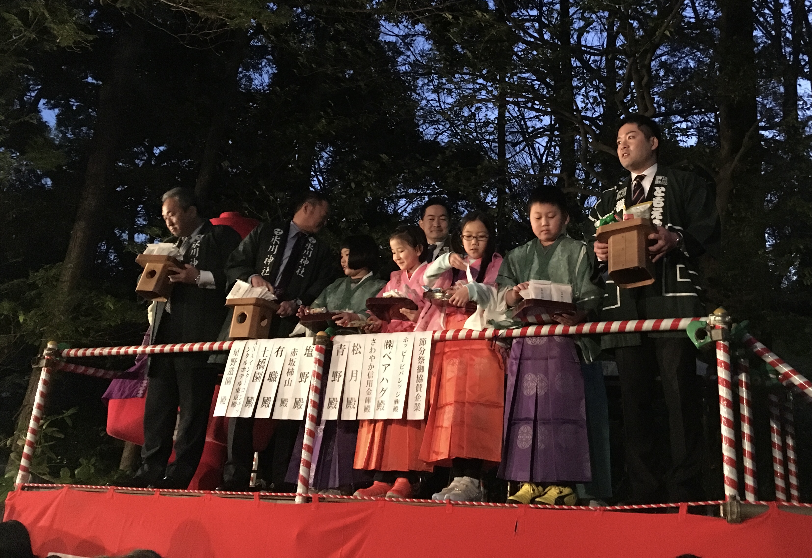

**Awa Odori Festival**

Awa Odori is one of Japan's most famous dance festivals, held in Tokushima each August. The event features coordinated dance groups, traditional music, and energetic evening street performances across multiple zones in the city.

The festival atmosphere is highly participatory: some sections are performance-focused, while others allow visitors to join simplified dance lines. It is one of the best summer cultural events in Shikoku.

&emsp;&emsp;**Practical info**

- Typical period: August 12-15.
- Main area: central Tokushima near station-side festival routes.
- Best strategy: book accommodation early and reach viewing areas before evening peak.

&emsp;&emsp;**Related location notes**

- See [Tokushima City](../../locations/regions/7.%20Shikoku/Tokushima/Tokushima%20City.md)
