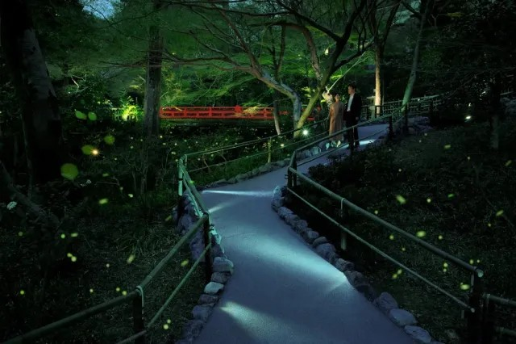

**Firefly Festival (Hotaru Matsuri)**

Firefly festival is held in many places across Japan in June, where you can see fireflies light up the night sky.

One of the most famous places to see fireflies is in the Fussa area of Tokyo, where the Tama River is home to many fireflies. The festival usually includes food stalls, traditional music, and sometimes even boat rides along the river to see the fireflies up close.

Another popular location is the Genji Firefly Festival in Kyoto, where you can see the Genji fireflies, which are a symbol of love and are often associated with the story of Genji Monogatari.
