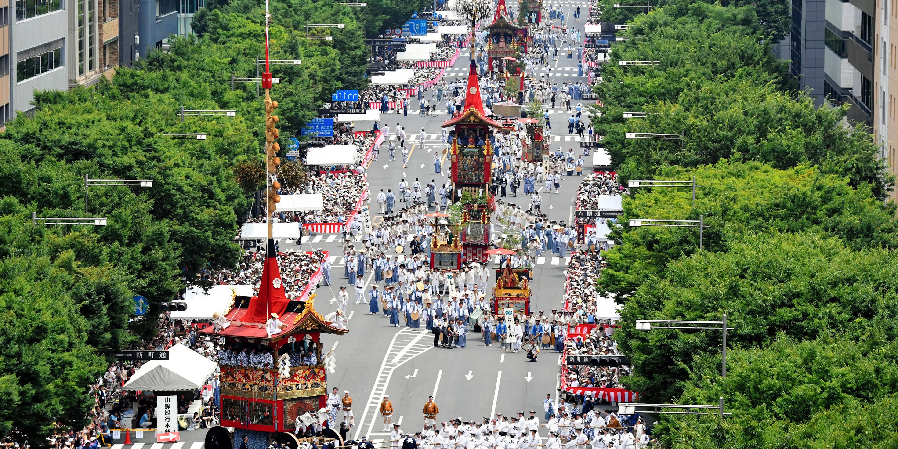
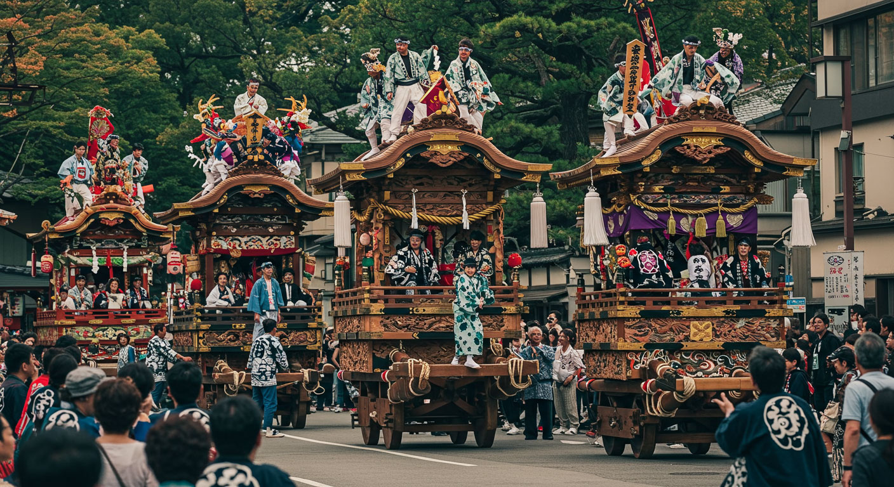
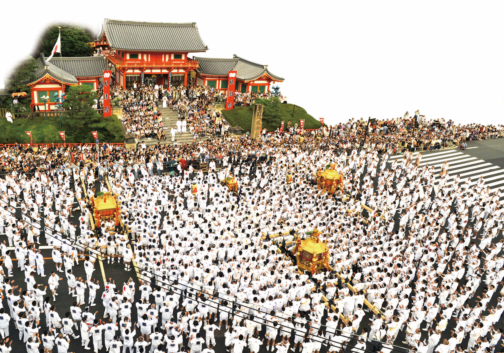
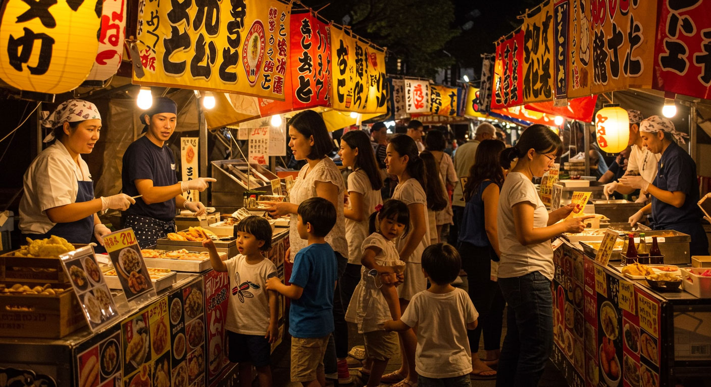

**Gion Matsuri Festival**

Gion Matsuri is one of Japan's most famous traditional festivals and is held in Kyoto throughout July. The festival began more than a thousand years ago as a purification ritual to pray for protection from epidemics and disasters.

The most iconic part of the festival is the Yamaboko Junko parade, where massive wooden floats are pulled through central Kyoto. In the evenings before the main parade days (Yoiyama), the streets fill with food stalls, lanterns, and people wearing yukata.

The festival atmosphere is lively but still deeply connected to local traditions and neighborhood communities that maintain the floats. If you visit in July, Gion Matsuri is one of the best ways to experience Kyoto's summer culture.

