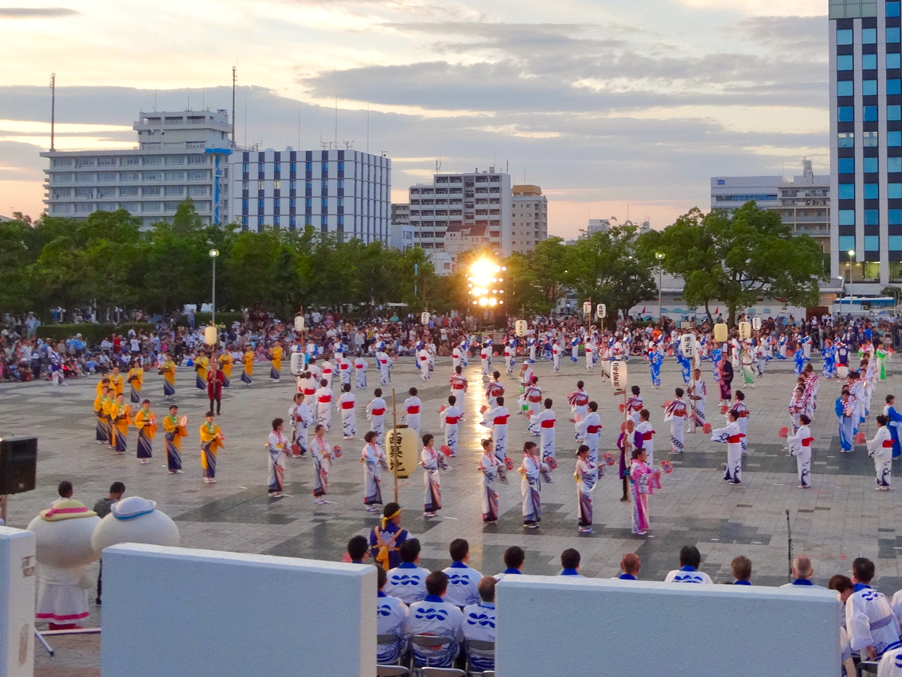
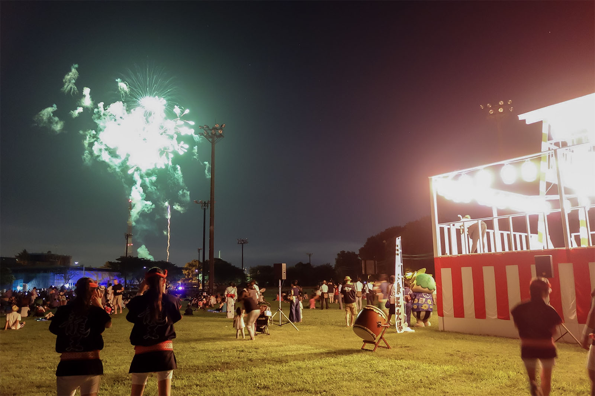

**Obon Festival**

Obon is a traditional Japanese festival held in mid-July in some regions and in mid-August in others. It is a time when families honor the spirits of their ancestors and gather with relatives in their hometowns.

During Obon, people visit family graves, clean and decorate them, and make offerings. In many towns and neighborhoods, Bon Odori dances are performed in public squares, creating a warm and festive summer atmosphere.

Another symbolic part of Obon is guiding ancestral spirits with lanterns and community rituals. Depending on the region, there may be local processions, dances, and special events connected to long-standing traditions.

