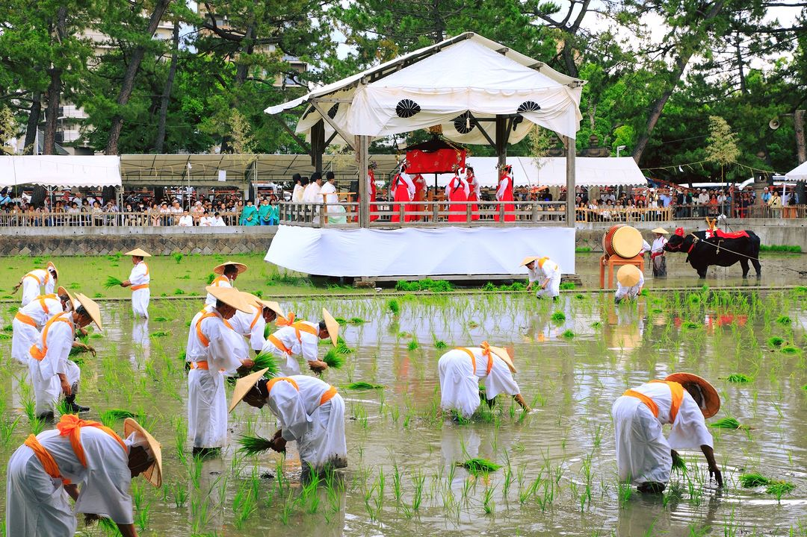

**Otaue Festival**

The Otaue Festival is a traditional rice-planting festival held in early summer, with well-known events in the Kansai region. Participants plant rice seedlings in ceremonial style while wearing traditional clothing, accompanied by music and ritual performances.

It is both an agricultural ritual and a cultural celebration, offering a rare chance to see how rice cultivation traditions are preserved in modern Japan.

For travelers in June, Otaue events are a good way to experience rural seasonal culture and rituals connected to Japan's farming calendar.

