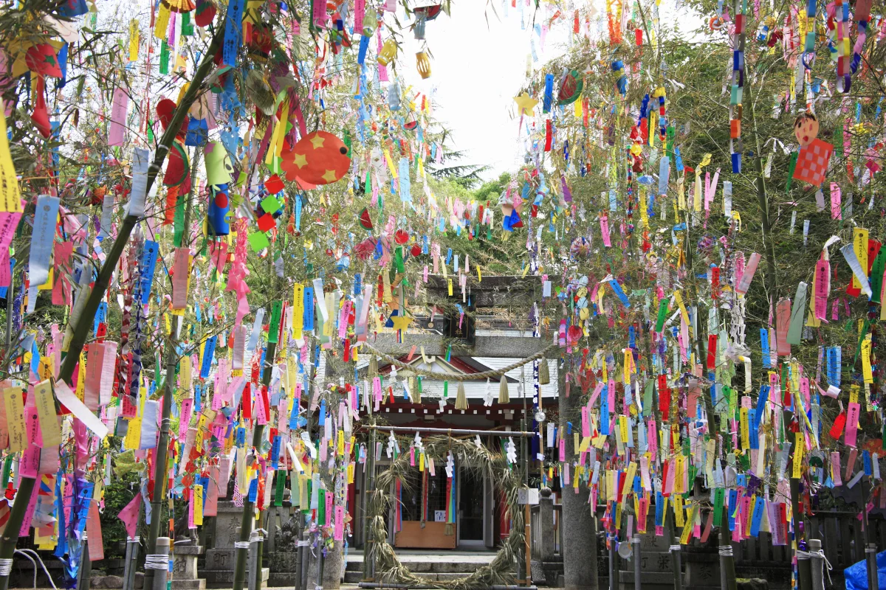
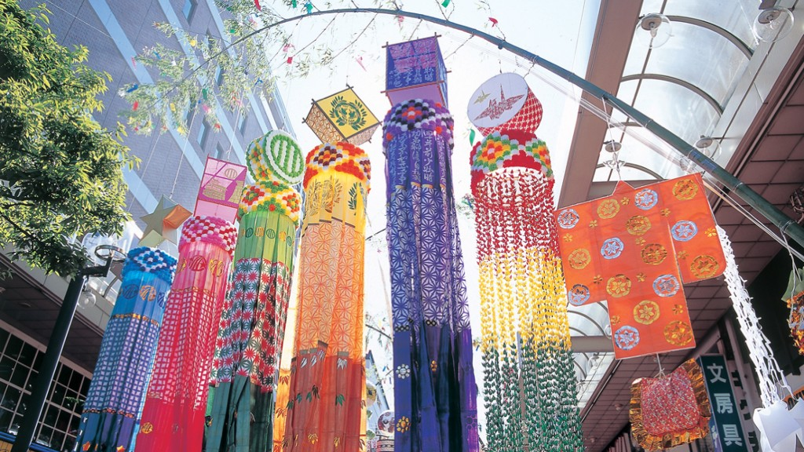
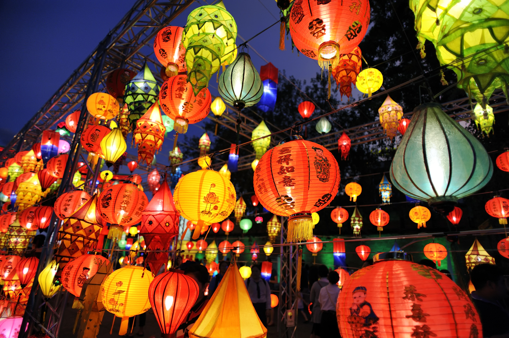
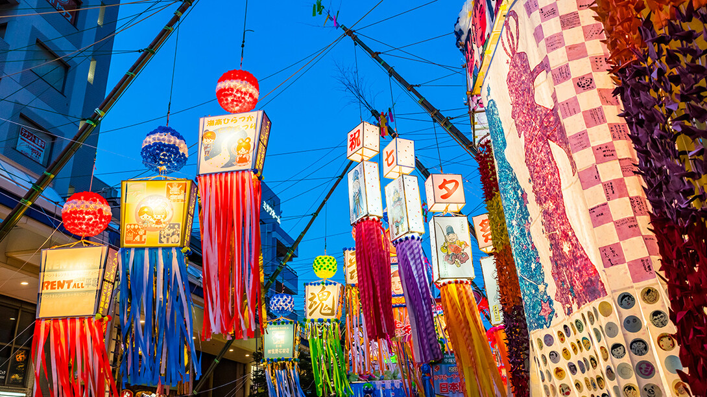
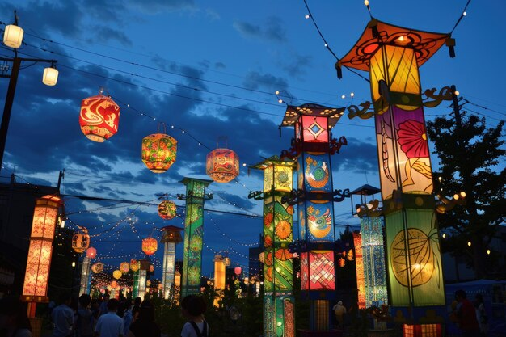
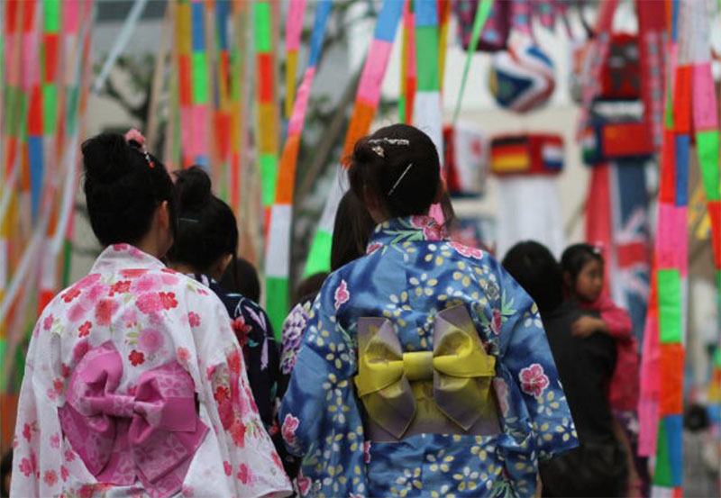
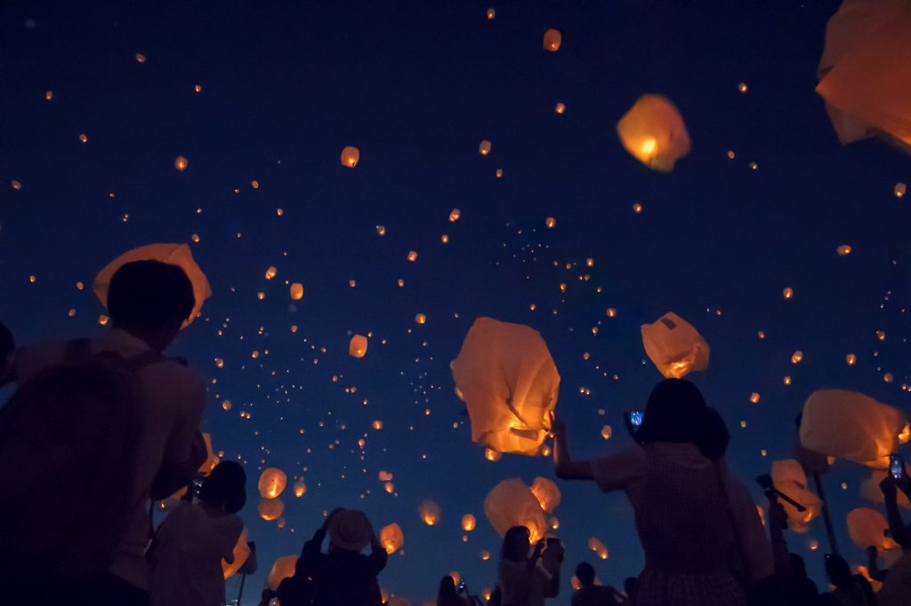
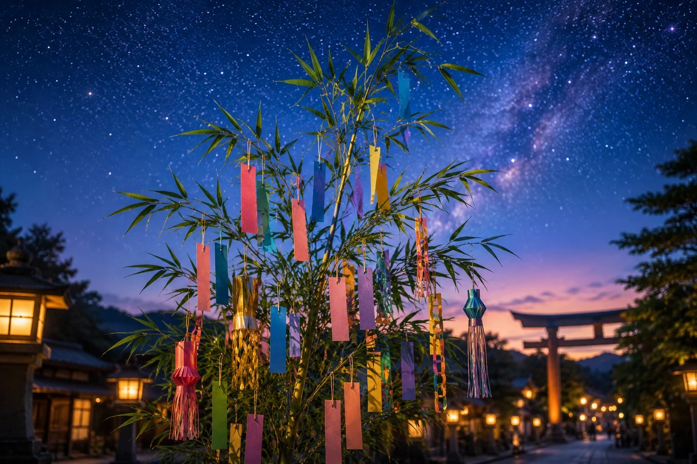

**Tanabata Festival**

Otherwise known as "Star Festiwal", takes place on June 7, but the preparations start in as early as June. The festival celebrates the meeting of the deities Orihime and Hikoboshi, represented by the stars Vega and Altair respectively. According to legend, these lovers are separated by the Milky Way and can only meet once a year on the seventh day of the seventh lunar month.
During the festival, people write their wishes on small pieces of paper called tanzaku and hang them on bamboo branches, hoping that their wishes will come true. The bamboo and decorations are often set afloat on a river or burned after the festival, symbolizing the sending of wishes to the heavens.

 

In some regions of Japan, there are also parades and other festivities to celebrate Tanabata. For example, in Sendai, the Tanabata Festival is one of the largest in Japan, featuring colorful streamers and decorations that line the streets. 

Yukata, a traditional summer kimono, is often worn during the festival, adding to the festive atmosphere.

Lanterns are also a common sight during the Tanabata Festival, with many people releasing them into the sky or floating them on rivers. The lanterns symbolize the hopes and dreams of the participants, creating a magical and enchanting atmosphere during the festival.

Overall, the Tanabata Festival is a wonderful celebration of love, hope, the power of wishes, and the beauty of the night sky.

