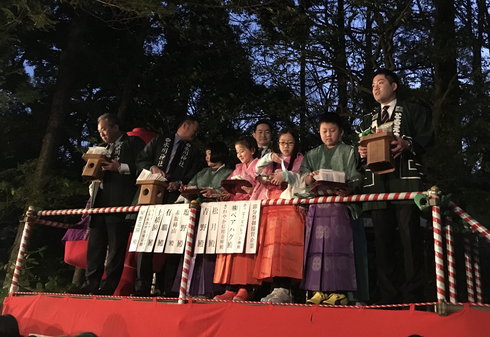
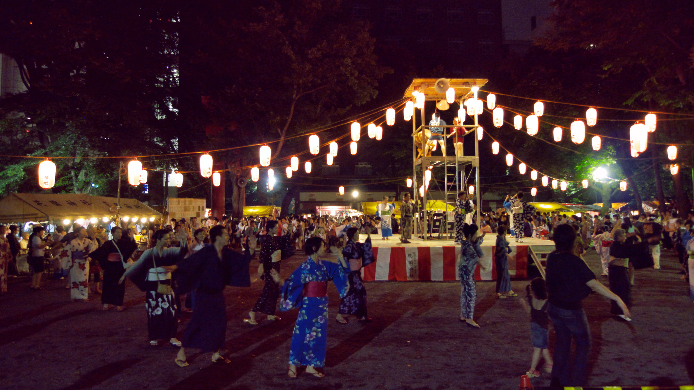
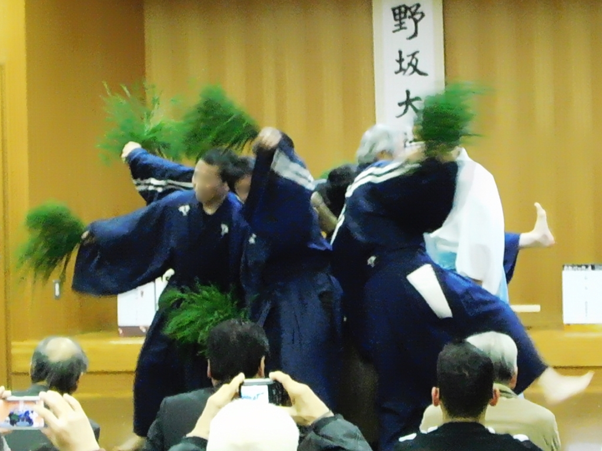
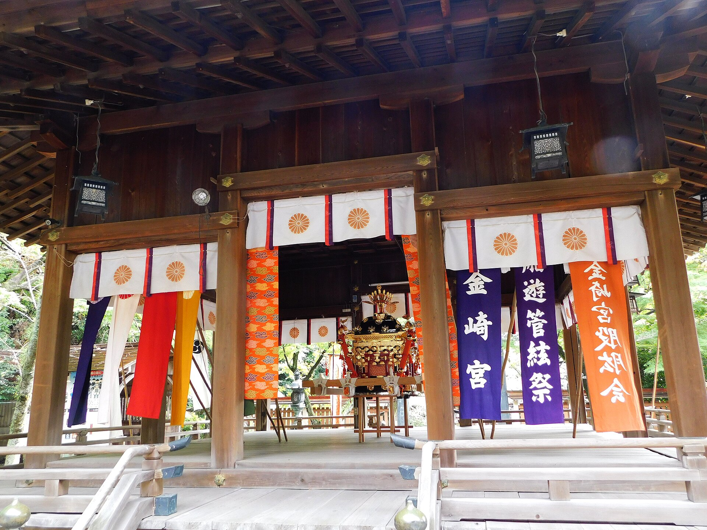

**Tsuruga Festival (Fukui)**

Tsuruga Festival is a local celebration period in Tsuruga City, with shrine-centered events, processions, and neighborhood participation.

It is a strong option for travelers who want a less tourist-heavy regional matsuri experience.

&emsp;&emsp;**Best season/month**

- Festival timing varies by shrine calendar; check yearly local schedules before travel.

&emsp;&emsp;**What to expect**

- Shrine ceremonies and neighborhood procession routes.
- Local food stalls and evening crowd activity around event zones.

&emsp;&emsp;**Practical note**

- Train and road congestion can increase during peak event windows, so allow extra transfer time.

