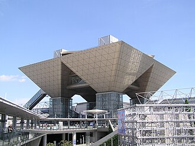

**AnimeJapan (Tokyo)**

AnimeJapan is one of Japan's largest annual anime industry conventions, featuring studios, stage events, merchandise, and upcoming title announcements.

It is a major yearly event for anime fans and industry watchers.

&emsp;&emsp;**Typical timing**

- Usually held in March (annual)

&emsp;&emsp;**Practical note**

- Weekend public days are busiest; check stage-ticket rules in advance.
