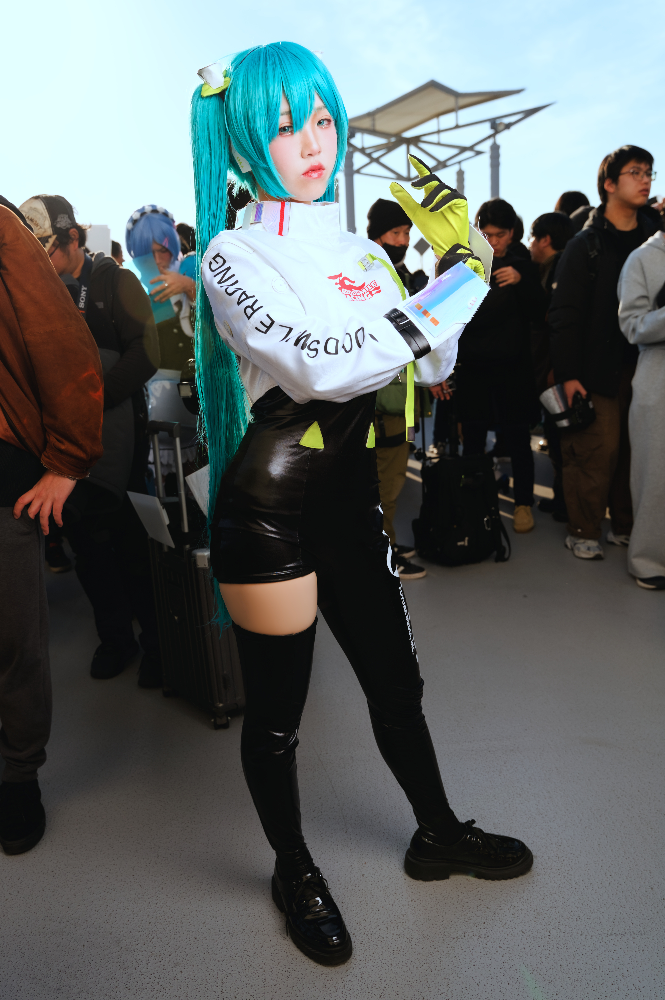
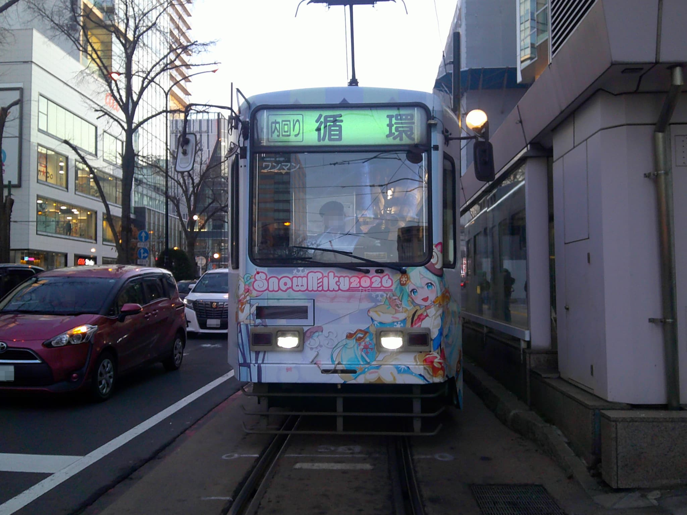

**Hatsune Miku Events and Venues (Japan)**

Hatsune Miku has regular live-event activity in Japan, especially in Tokyo-area venues and in Sapporo winter programming.

&emsp;&emsp;**Recurring annual events (check exact dates each year)**

- Magical Mirai (typically Aug-Sep, Osaka and/or Tokyo-area): concert plus creator exhibition and goods area.
- Snow Miku program (typically Feb, Sapporo): collaborations, themed transport, pop-up exhibits, and winter festival tie-ins.
- Miku-related stage appearances at large conventions can also appear in event calendars depending on year.

&emsp;&emsp;**Common venues and areas**

- Makuhari Messe / Tokyo-area convention halls for large scale events.
- Osaka major halls for rotating editions of Magical Mirai.
- Sapporo city center and festival-linked spots for Snow Miku period activities.

&emsp;&emsp;**Ticket and planning notes**

- Concert and premium entry tiers can sell out fast; lottery or early sales are common.
- February (Sapporo) and late summer weekends (Tokyo/Osaka) are high-demand windows.
- If attending mainly for merch, check separate sales time slots and entry windows.

&emsp;&emsp;**Practical note**

- Event formats and city lineup can change year to year, so confirm only from official event pages before booking flights and hotels.
