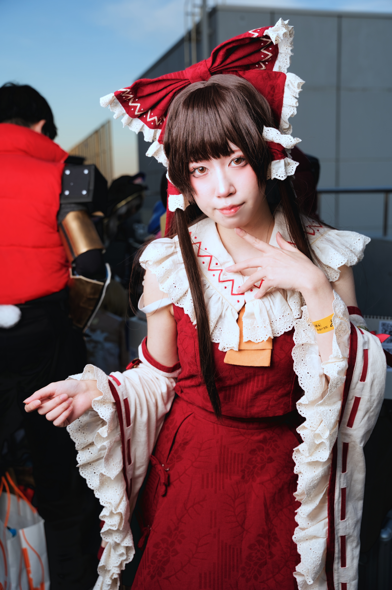
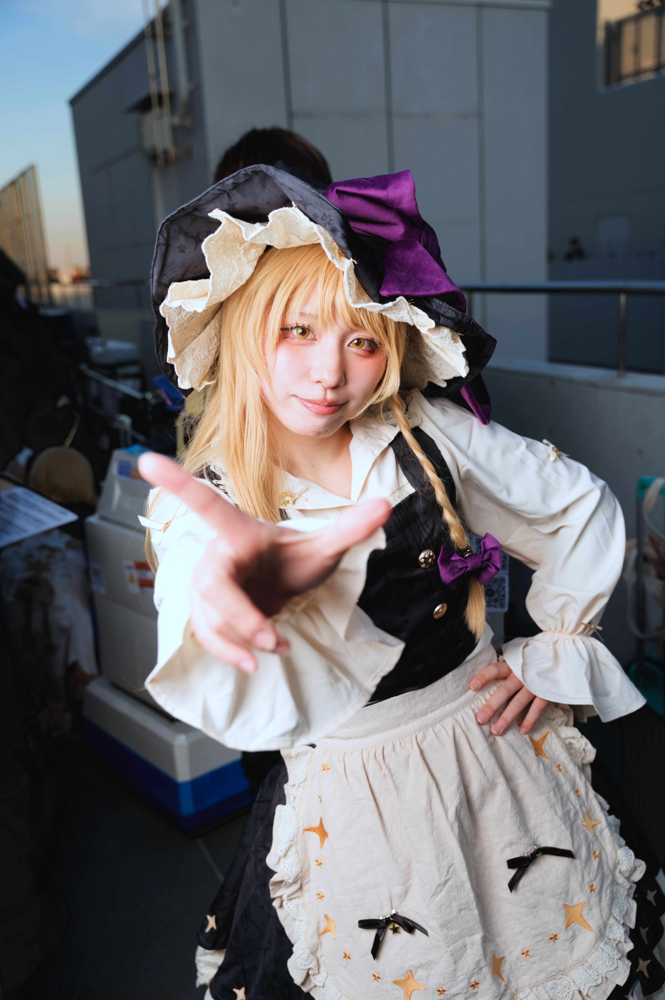

**Project Touhou Events and Venues (Japan)**

Project Touhou is most visible through doujin-focused events, fan music circles, and cosplay-heavy convention culture rather than one single official touring format.

&emsp;&emsp;**Recurring annual events (check exact dates each year)**

- Hakurei Jinja Reitaisai (Tokyo area): one of the largest Touhou-only doujin events.
- Comiket participation (Tokyo, usually Aug and Dec): major Touhou circle presence in doujin and cosplay zones.
- Touhou-focused live/DJ and doujin music events appear multiple times yearly in Tokyo and Kansai.

&emsp;&emsp;**Common venues and areas**

- Tokyo Big Sight (for major fan conventions and related events).
- Akihabara shops for Touhou doujin music and fan goods.
- Event halls in Ikebukuro and other Tokyo neighborhoods for smaller fan gatherings.

&emsp;&emsp;**Ticket and planning notes**

- Touhou-only events can use advance ticketing or time-slot entry.
- Doujin events can have strict photography and resale rules; check organizer policy first.
- Peak crowd periods align with large convention weekends and holiday travel periods.

&emsp;&emsp;**Practical note**

- Schedules and venue assignment vary each year, so verify official organizer announcements before locking itinerary.
