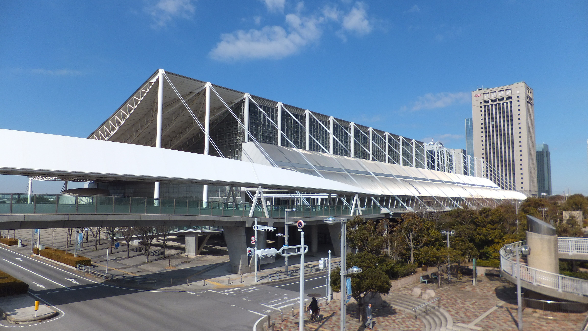

**Tokyo Game Show (Chiba, Makuhari Messe)**

Tokyo Game Show is one of the most prominent global video-game conventions, featuring major publishers, indie games, hardware, and esports showcases.

It is a key annual technology-and-entertainment event for gaming culture in Japan.

&emsp;&emsp;**Typical timing**

- Usually held in September (annual)

&emsp;&emsp;**Practical note**

- Business days and public days differ; check admission type before booking.

