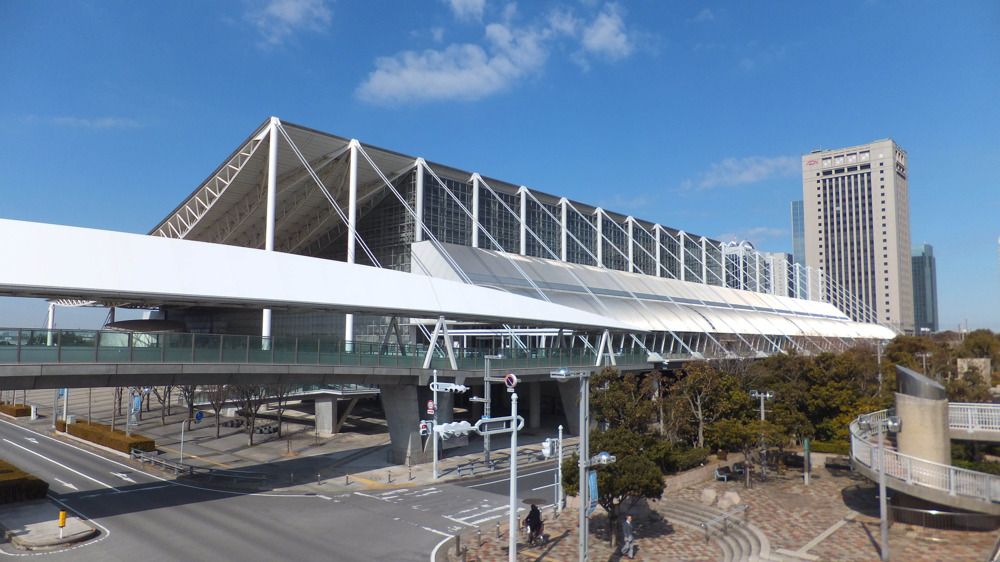

**Wonder Festival (Chiba, Makuhari Messe)**

Wonder Festival is one of Japan's most famous figure/model conventions, especially popular with anime, game, and collectible communities.

It is a major otaku-culture event focused on garage kits, sculpting, and figure releases.

&emsp;&emsp;**Typical timing**

- Winter edition (around February)
- Summer edition (around July)

&emsp;&emsp;**Practical note**

- Arrive early for limited items and popular vendor lines.
