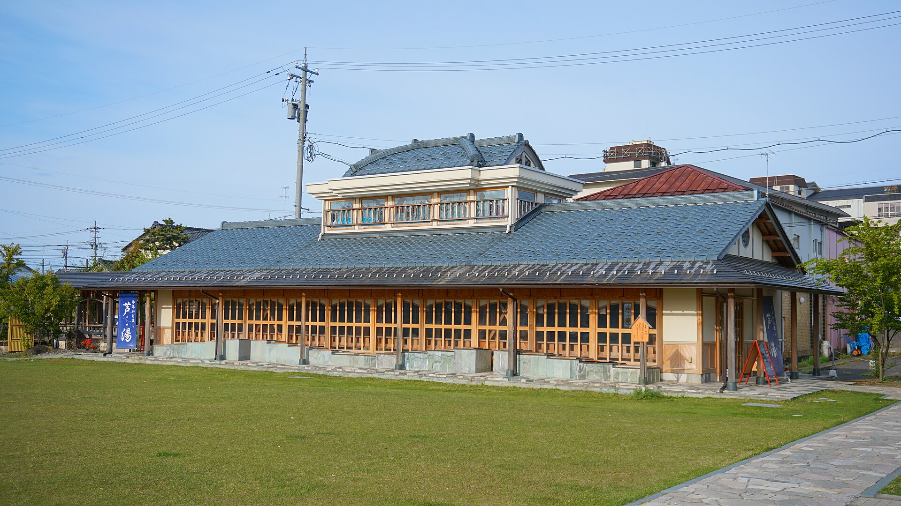
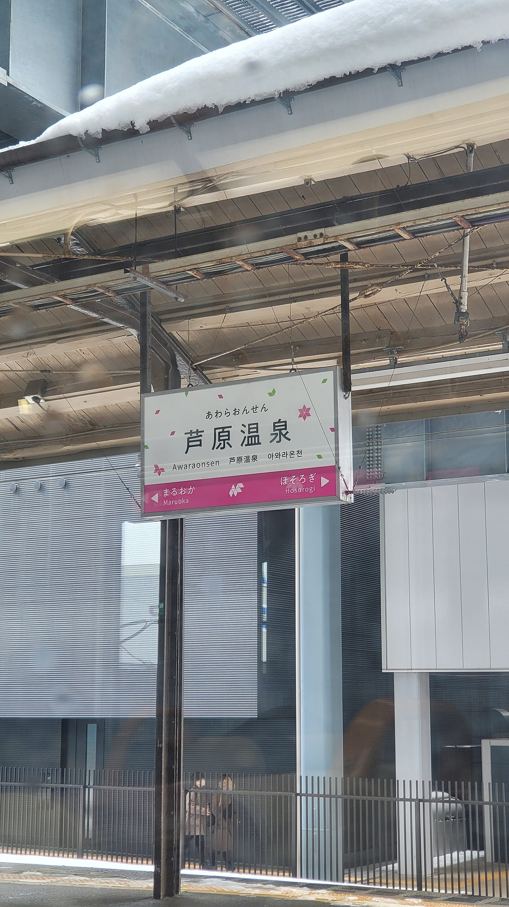
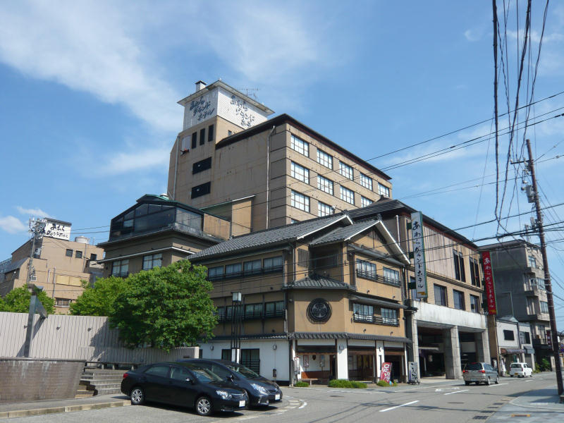
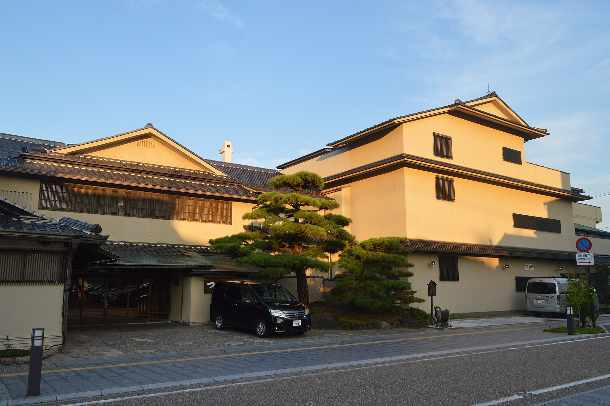

**Awara Onsen Mimatsu Tomari (Awara, Fukui)**

Awara Onsen Mimatsu Tomari is a ryokan-style stay option in Fukui's Awara Onsen area, suited for travelers who want a hot-spring-focused overnight base.

It is best used as a slower rest stop between regional sightseeing days.

&emsp;&emsp;**Best season/month**

- Year-round, with winter and autumn being especially appealing for onsen stays.

&emsp;&emsp;**What to expect**

- Traditional Japanese inn atmosphere.
- Onsen bathing and slower evening routine compared with city hotels.

&emsp;&emsp;**Practical note**

- Confirm dinner/breakfast package details and check-in windows when booking.

