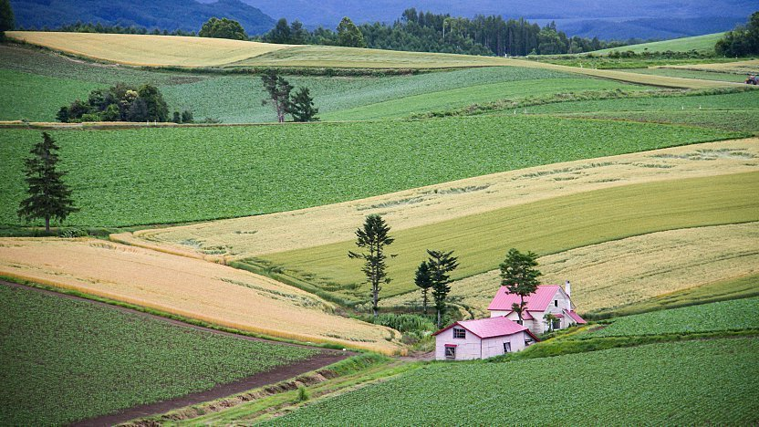
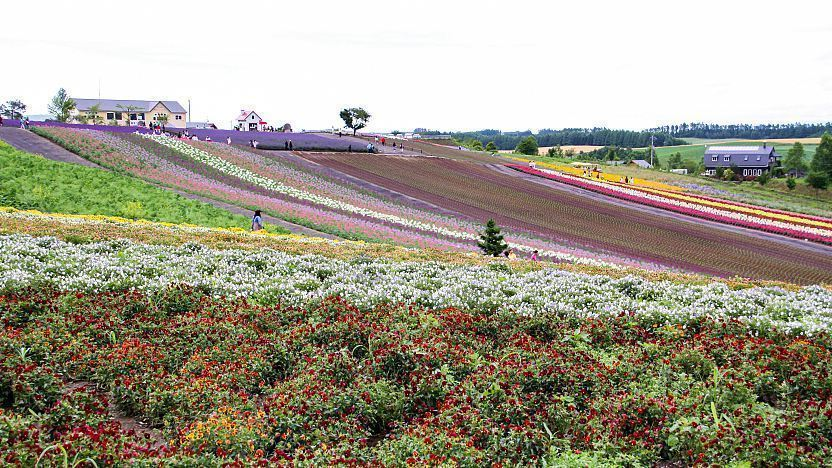
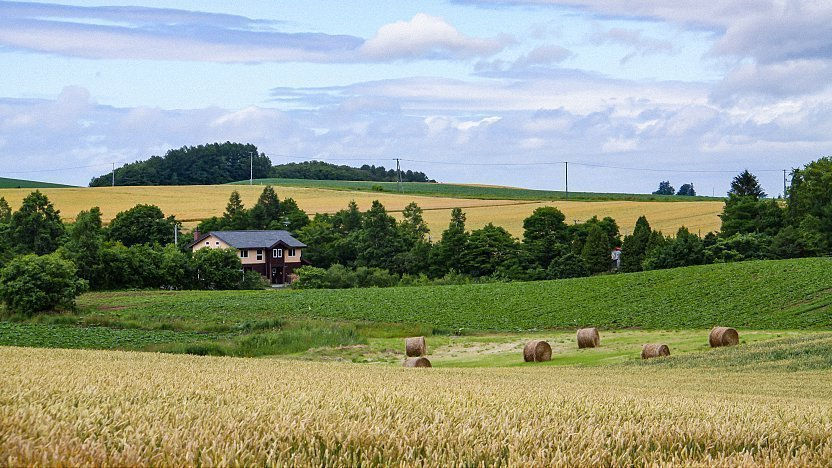

**Biei Town**

Biei is a small town surrounded by a picturesque landscape of gently rolling hills and vast fields. A pleasant way to enjoy the charm of Biei is by cycling or driving through the hills and visiting some of the flower fields and famous trees. The area northwest of the town center is named "**Patchwork Road**" and the area south of the town center "**Panorama Road**".

Biei is located between Asahikawa and Furano, about a 30-40 minutes car or train ride from either city. There is about one train per hour. Biei is also located close to Asahikawa Airport and can be reached from there directly by the Lavender-go bus (15 minutes, one bus every 1-2 hours), which connects Asahikawa Station with Asahikawa Airport, Biei and Furano.

Rental bicycles (including electrically powered ones) are available from multiple stores in central Biei. The typical rate is 200 yen per hour for a regular bicycle and 600 yen per hour for an electrical one.

During summer, the sights of Biei are visited by various sightseeing buses starting from Furano, Biei and Asahikawa stations.

