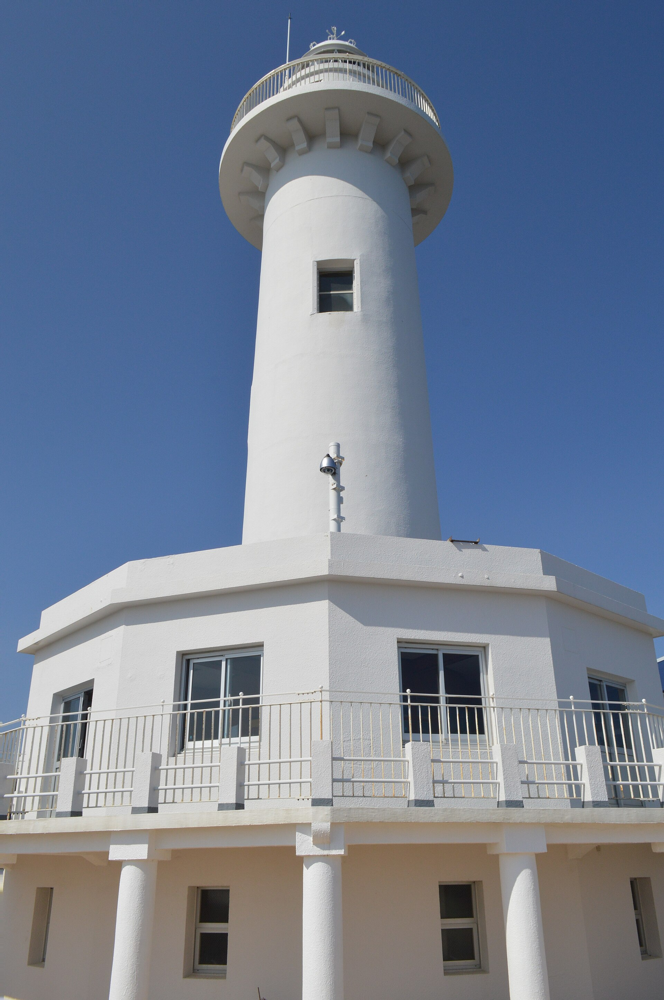
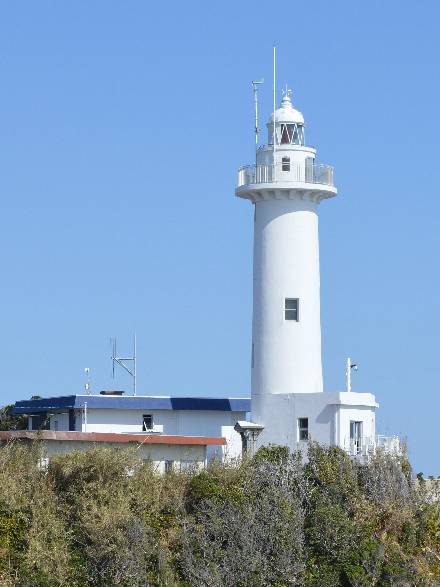
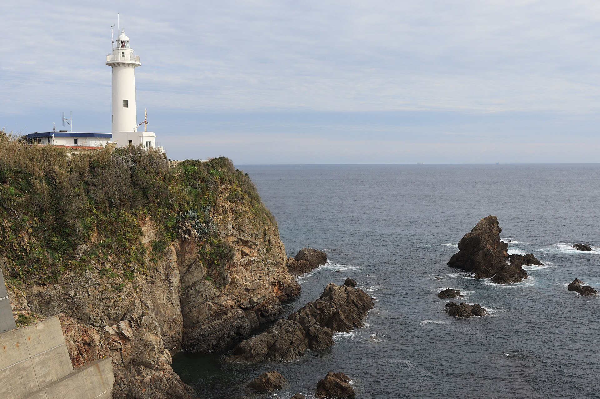

**Daio Lighthouse**

Daio Lighthouse is a lighthouse in Mie Prefecture, Japan. It is included in Japan's official Fifty Lighthouses selection, recognising it as one of the country's most scenic and historically significant navigational lights.

&emsp;&emsp;**Why visit**

- Distinctive coastal setting well suited to photography, a short walk, and a break from inland travel.
- Works well as a compact maritime-heritage stop alongside a harbor walk, coast road, or nearby scenic viewpoint.
- Recognised as one of Japan's Fifty Lighthouses — a useful quality marker for lighthouse-tourism planning.

&emsp;&emsp;**Tour / access**

- This is one of Japan's officially tourable lighthouses — the tower interior and lantern room can be visited on open days. Check current opening hours and admission before going, as schedules vary seasonally.
- Coastal weather, ferry schedules, and seasonal opening rules can materially affect the stop — worth checking in advance.

&emsp;&emsp;**Practical note**

- Pair with a nearby cape, fishing town, shrine, or coastal road stop rather than making the lighthouse the sole objective of the day.
- Sunset and clear-weather visits tend to be the most rewarding; exposed headlands become far less pleasant in strong wind or rain.

