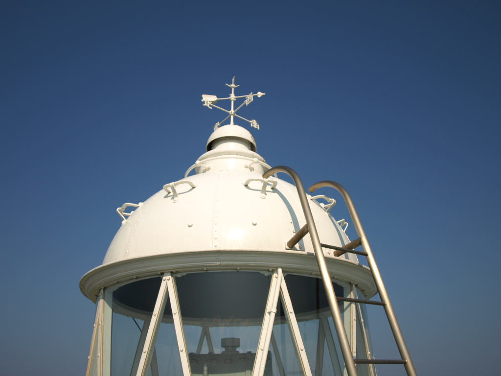
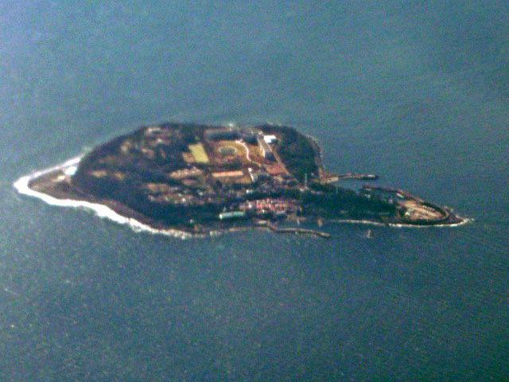
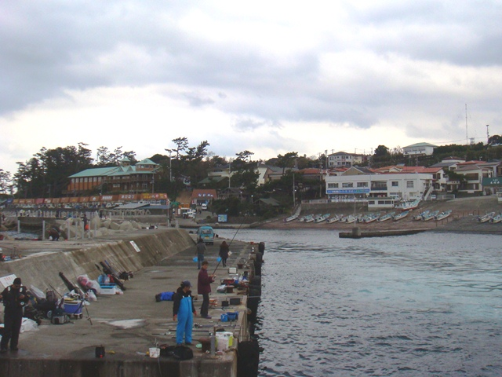

**Hatsushima Lighthouse**

Hatsushima Lighthouse is a lighthouse in Shizuoka Prefecture, Japan.

&emsp;&emsp;**Why visit**

- Distinctive coastal setting well suited to photography, a short walk, and a break from inland travel.
- Island access can add significant timing — check whether a bridge or ferry is running before committing the stop.

&emsp;&emsp;**Tour / access**

- This is one of Japan's officially tourable lighthouses — the tower interior and lantern room can be visited on open days. Check current opening hours and admission before going, as schedules vary seasonally.
- Coastal weather, ferry schedules, and seasonal opening rules can materially affect the stop — worth checking in advance.

&emsp;&emsp;**Practical note**

- Pair with a nearby cape, fishing town, shrine, or coastal road stop rather than making the lighthouse the sole objective of the day.
- Sunset and clear-weather visits tend to be the most rewarding; exposed headlands become far less pleasant in strong wind or rain.

