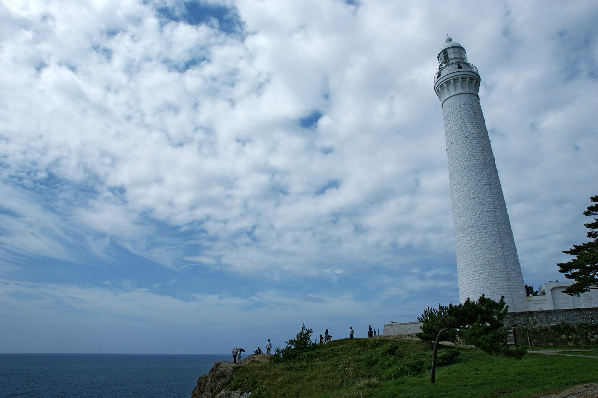
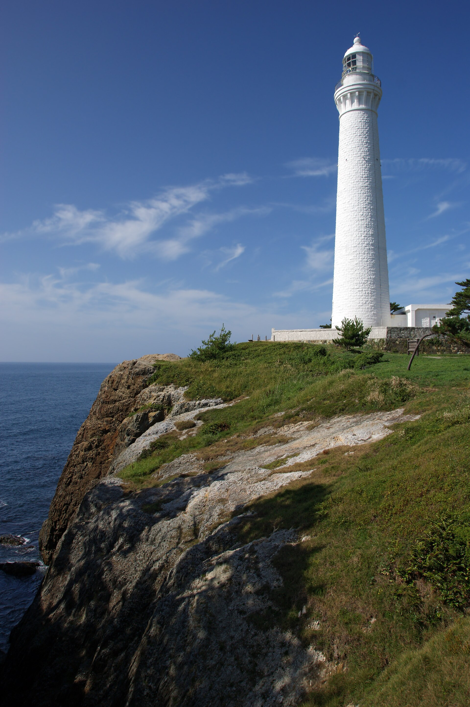

**Izumo Hinomisaki Lighthouse**

Izumo Hinomisaki Lighthouse is a lighthouse in Shimane Prefecture, Japan. It is one of the country's tourable lighthouses, with interior access on designated open days. It is included in Japan's official Fifty Lighthouses selection.

&emsp;&emsp;**Why visit**

- Distinctive coastal setting that works well for photography and a short scenic stop.
- Tower access makes it more rewarding than an exterior-only lighthouse visit.
- Recognised as one of Japan's Fifty Lighthouses.

&emsp;&emsp;**Tour / access**

- Check opening days and admission before visiting.
- Weather and transport schedules can affect the experience.

&emsp;&emsp;**Practical note**

- Pair it with nearby coast roads, capes, or harbor stops.

