**Non-Tourable Lighthouses of Japan**

This page collects Japan's exterior-only lighthouses in one place. Each entry includes a single photo reference and a short location/history summary.

## Aichi Prefecture

### Iragozaki Lighthouse (伊良湖岬灯台)

Iragozaki Lighthouse is an exterior-viewing lighthouse in Aichi Prefecture. It remains a useful coastal marker and scenic stop even though tower entry is not available, and it is often visited as part of a broader headland or island route.

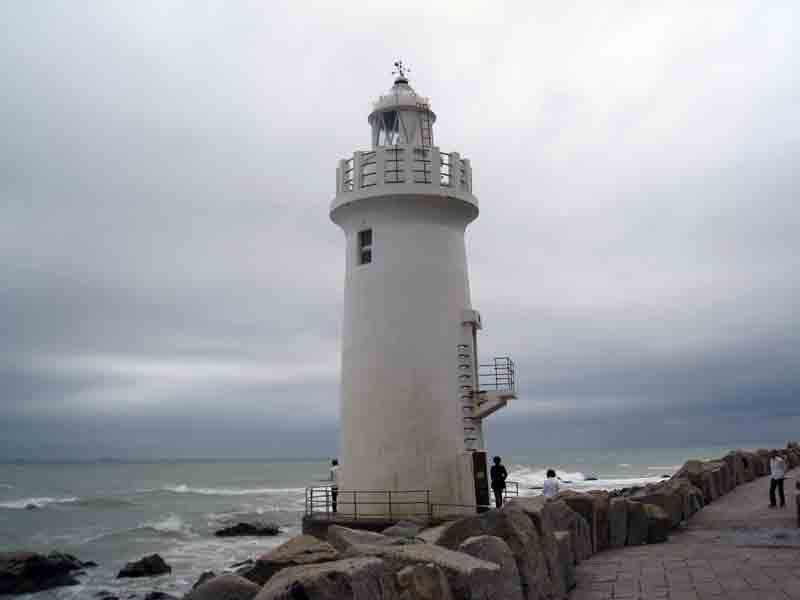

### Nomazaki Lighthouse (野間埼灯台)

Nomazaki Lighthouse is an exterior-viewing lighthouse in Aichi Prefecture. It remains a useful coastal marker and scenic stop even though tower entry is not available, and it is often visited as part of a broader headland or island route.

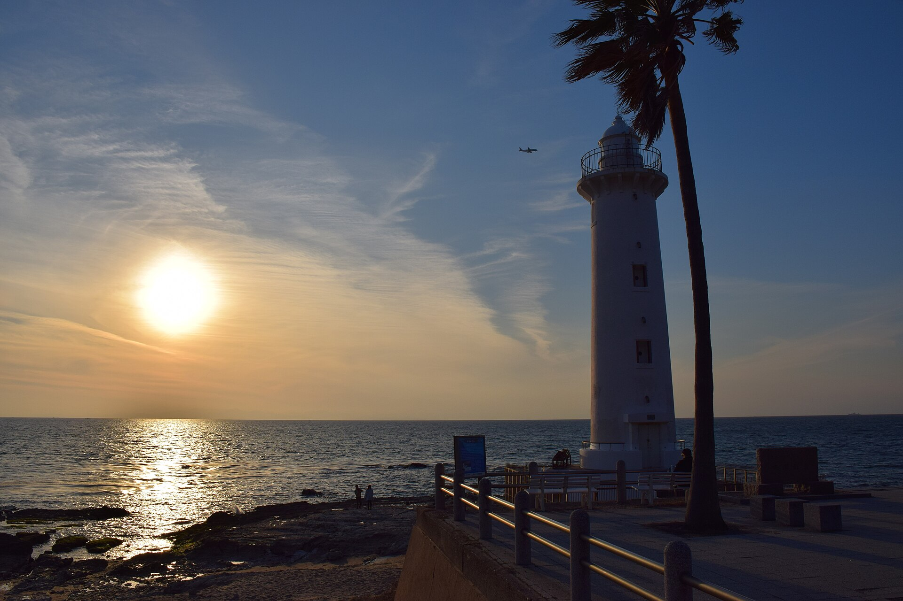

## Aomori Prefecture

### Omazaki Lighthouse (大間崎灯台)

Omazaki Lighthouse is an exterior-viewing lighthouse in Aomori Prefecture. It remains a useful coastal marker and scenic stop even though tower entry is not available, and it is often visited as part of a broader headland or island route.

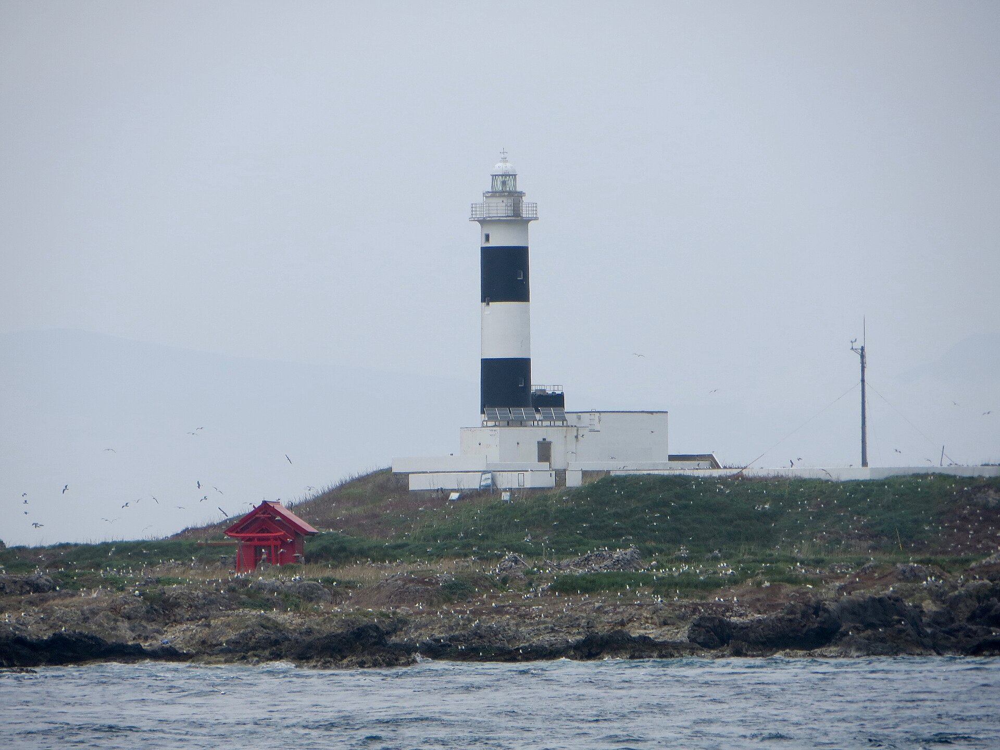

### Samekado Lighthouse (鮫角灯台)

Samekado Lighthouse is an exterior-viewing lighthouse in Aomori Prefecture. It remains a useful coastal marker and scenic stop even though tower entry is not available, and it is often visited as part of a broader headland or island route.

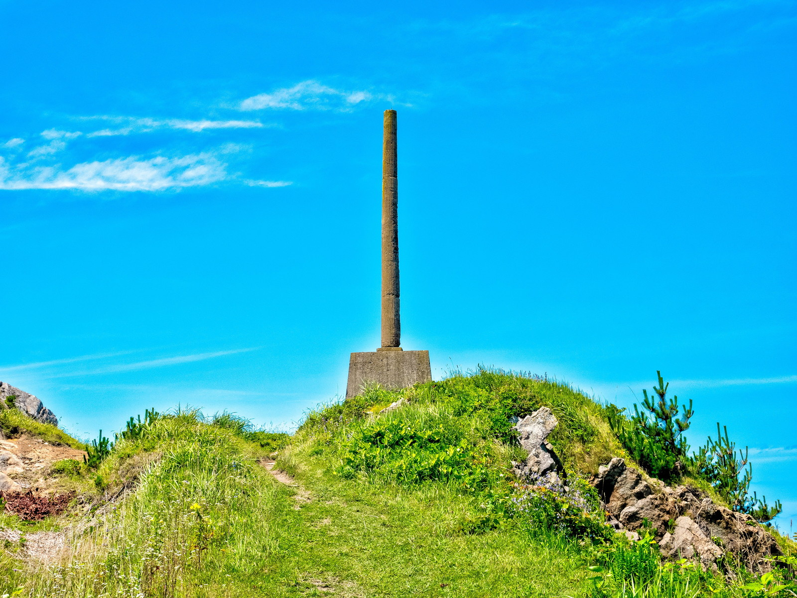

### Tappizaki Lighthouse (竜飛埼灯台)

Tappizaki Lighthouse is an exterior-viewing lighthouse in Aomori Prefecture. It remains a useful coastal marker and scenic stop even though tower entry is not available, and it is often visited as part of a broader headland or island route.

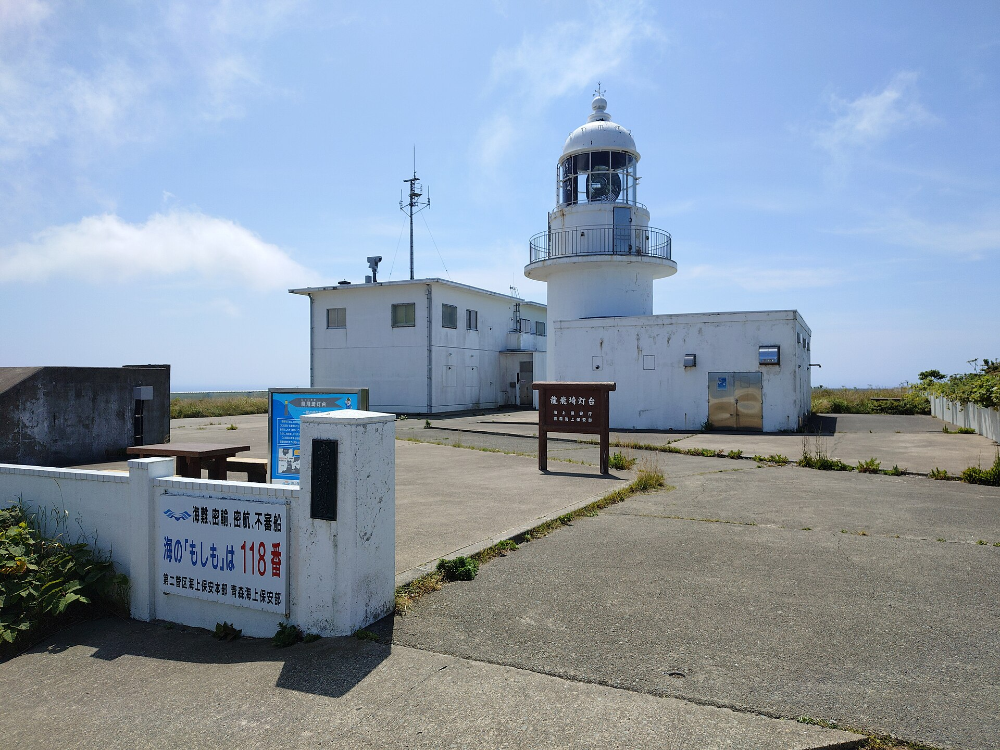

## Chiba Prefecture

### Sunosaki Lighthouse (洲埼灯台)

Sunosaki Lighthouse is an exterior-viewing lighthouse in Chiba Prefecture. It remains a useful coastal marker and scenic stop even though tower entry is not available, and it is often visited as part of a broader headland or island route.

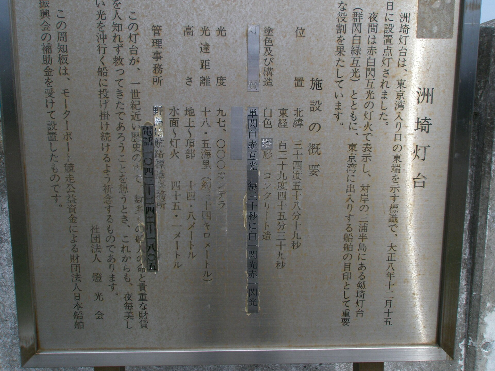

## Ehime Prefecture

### Sada Cape Lighthouse (佐田岬灯台)

Sada Cape Lighthouse is an exterior-viewing lighthouse in Ehime Prefecture. It remains a useful coastal marker and scenic stop even though tower entry is not available, and it is often visited as part of a broader headland or island route.

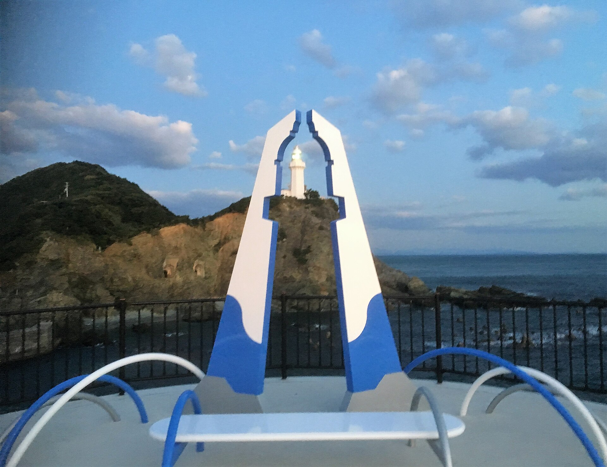

## Fukuoka Prefecture

### Hesaki Lighthouse (部埼灯台)

Hesaki Lighthouse is an exterior-viewing lighthouse in Fukuoka Prefecture. It remains a useful coastal marker and scenic stop even though tower entry is not available, and it is often visited as part of a broader headland or island route.

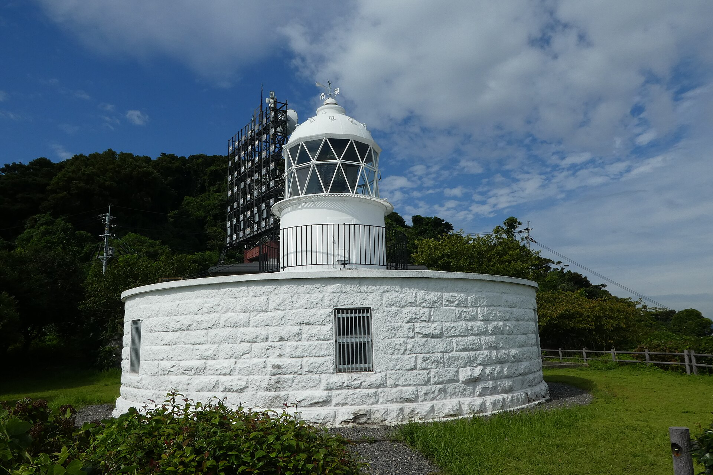

### Ono Lighthouse (大野灯台)

Ono Lighthouse is an exterior-viewing lighthouse in Fukuoka Prefecture. It remains a useful coastal marker and scenic stop even though tower entry is not available, and it is often visited as part of a broader headland or island route.

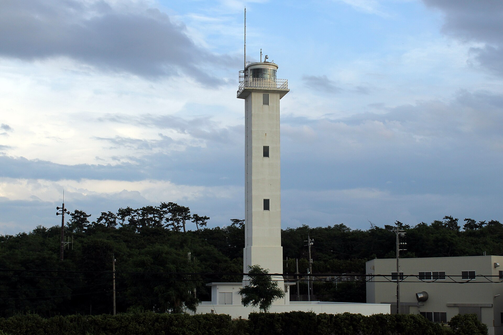

## Hiroshima Prefecture

### Takane Lighthouse (高根島灯台)

Takane Lighthouse is an exterior-viewing lighthouse in Hiroshima Prefecture. It remains a useful coastal marker and scenic stop even though tower entry is not available, and it is often visited as part of a broader headland or island route.

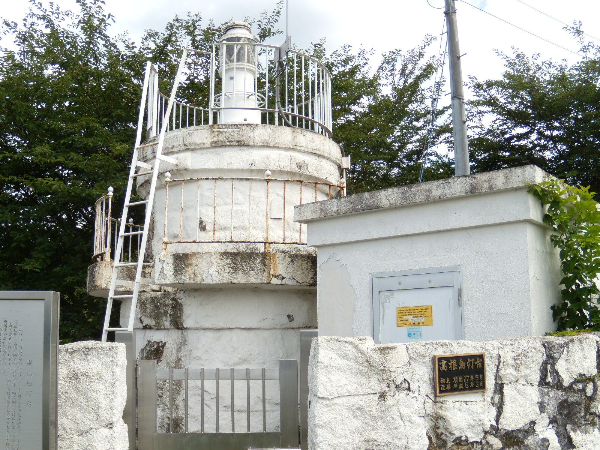

## Hokkaido

### Chikiu Cape Lighthouse (チキウ岬灯台)

Chikiu Cape Lighthouse is an exterior-viewing lighthouse in Hokkaido. It remains a useful coastal marker and scenic stop even though tower entry is not available, and it is often visited as part of a broader headland or island route.

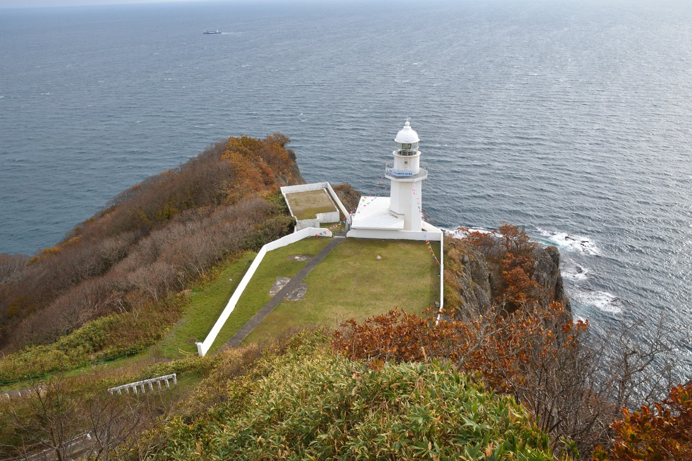

### Erimo Cape Lighthouse (襟裳岬灯台)

Erimo Cape Lighthouse is an exterior-viewing lighthouse in Hokkaido. It remains a useful coastal marker and scenic stop even though tower entry is not available, and it is often visited as part of a broader headland or island route.

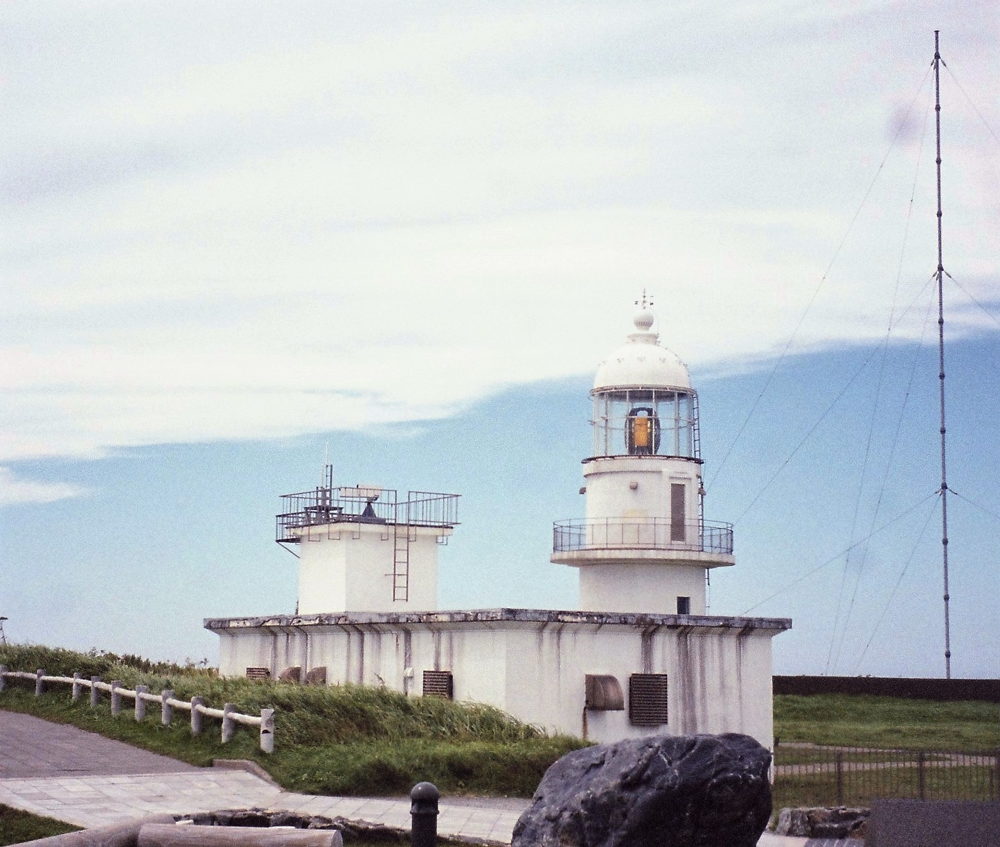

### Esanmisaki Lighthouse (恵山岬灯台)

Esanmisaki Lighthouse is an exterior-viewing lighthouse in Hokkaido. It remains a useful coastal marker and scenic stop even though tower entry is not available, and it is often visited as part of a broader headland or island route.

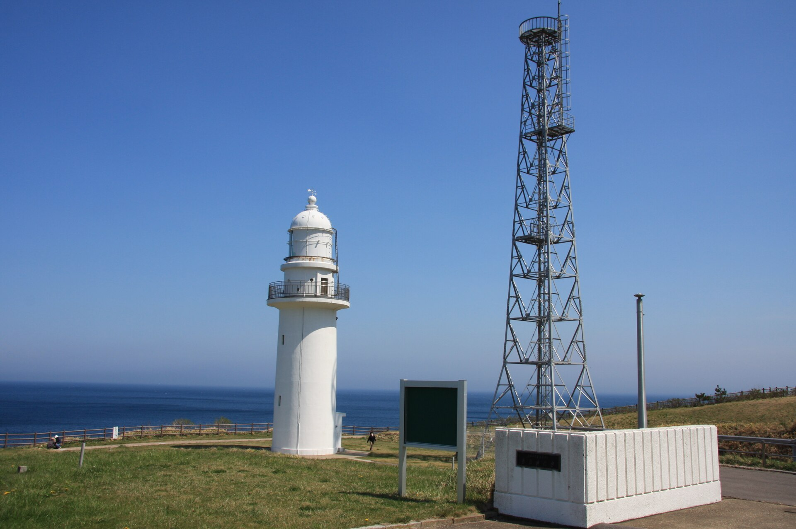

### Hanasaki Lighthouse (花咲灯台)

Hanasaki Lighthouse is an exterior-viewing lighthouse in Hokkaido. It remains a useful coastal marker and scenic stop even though tower entry is not available, and it is often visited as part of a broader headland or island route.

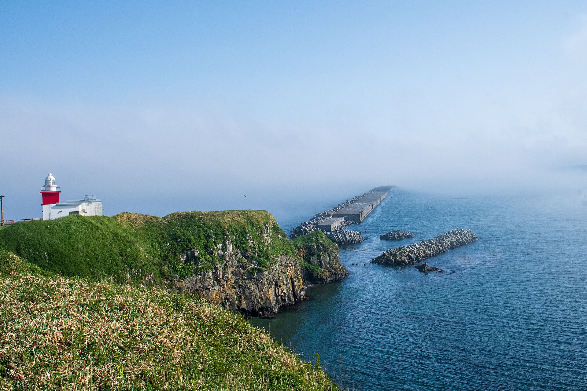

### Nosappumisaki Lighthouse (納沙布岬灯台)

Nosappumisaki Lighthouse is an exterior-viewing lighthouse in Hokkaido. It remains a useful coastal marker and scenic stop even though tower entry is not available, and it is often visited as part of a broader headland or island route.

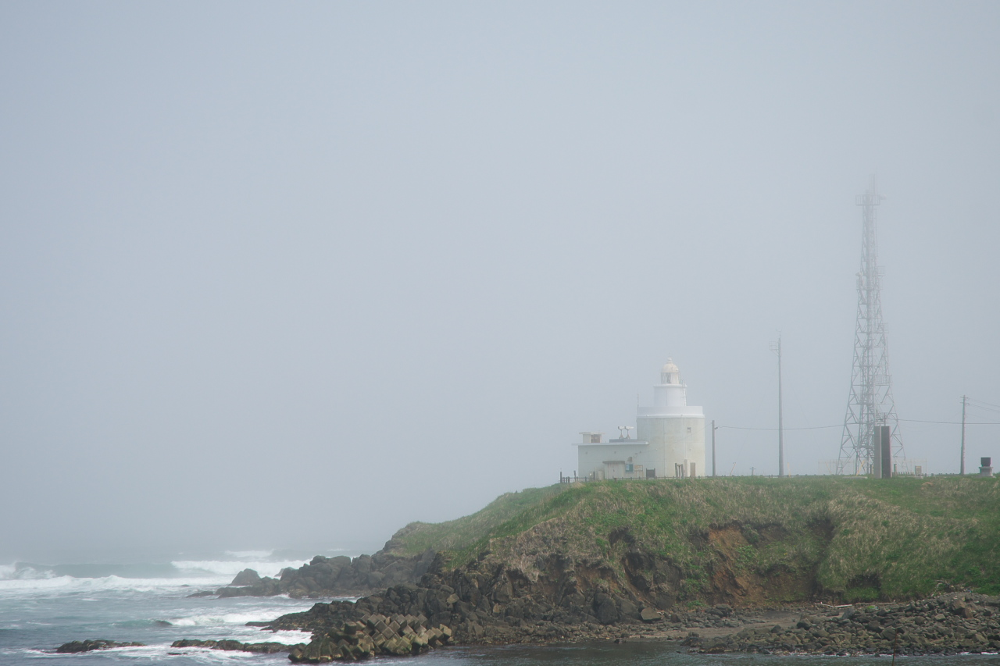

### Ochishi Lighthouse (落石岬灯台)

Ochishi Lighthouse is an exterior-viewing lighthouse in Hokkaido. It remains a useful coastal marker and scenic stop even though tower entry is not available, and it is often visited as part of a broader headland or island route.

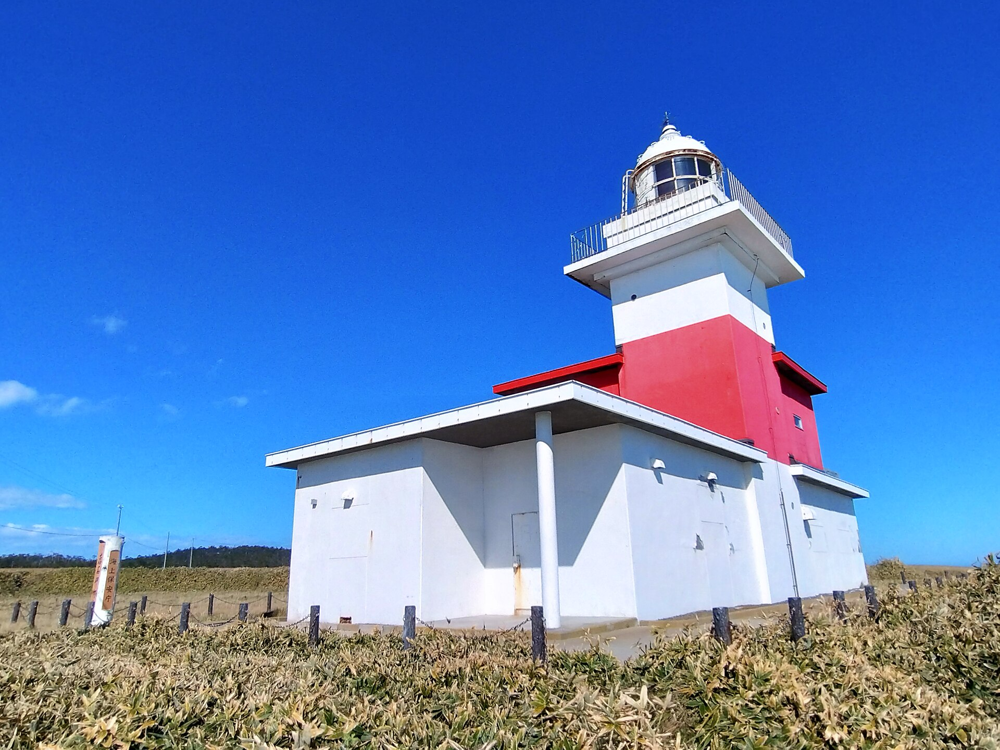

### Shiretoko Cape Lighthouse (知床岬灯台)

Shiretoko Cape Lighthouse is an exterior-viewing lighthouse in Hokkaido. It remains a useful coastal marker and scenic stop even though tower entry is not available, and it is often visited as part of a broader headland or island route.

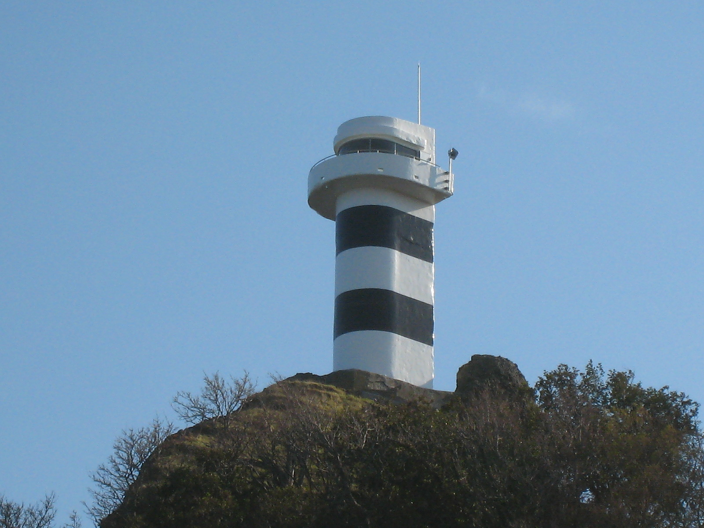

### Soya Cape Lighthouse (宗谷岬灯台)

Soya Cape Lighthouse is an exterior-viewing lighthouse in Hokkaido. It remains a useful coastal marker and scenic stop even though tower entry is not available, and it is often visited as part of a broader headland or island route.

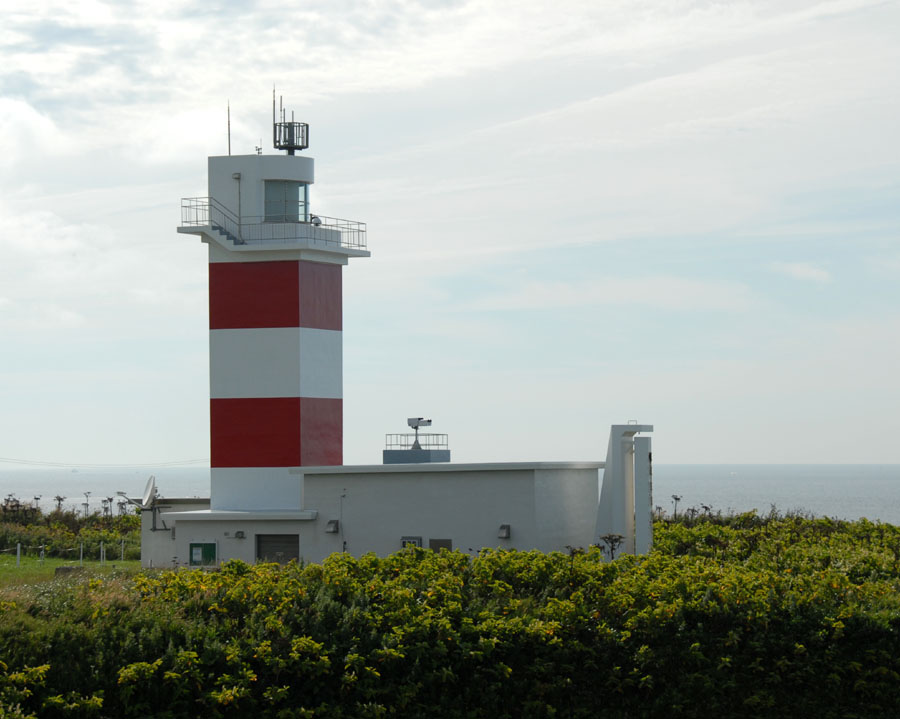

### Wakkanai Lighthouse (稚内灯台)

Wakkanai Lighthouse is an exterior-viewing lighthouse in Hokkaido. It remains a useful coastal marker and scenic stop even though tower entry is not available, and it is often visited as part of a broader headland or island route.

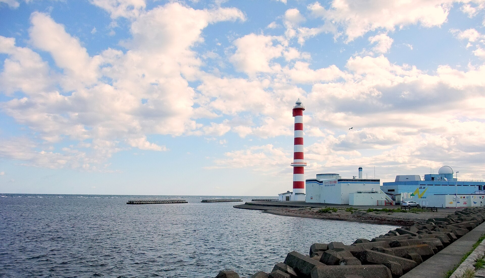

## Hyogo Prefecture

### Esaki Lighthouse (江埼灯台)

Esaki Lighthouse is an exterior-viewing lighthouse in Hyogo Prefecture. It remains a useful coastal marker and scenic stop even though tower entry is not available, and it is often visited as part of a broader headland or island route.

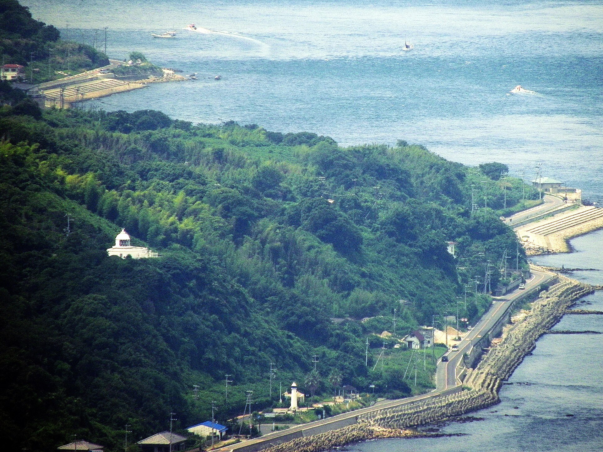

## Ishikawa Prefecture

### Eboshijima Lighthouse (恵比須島灯台)

Eboshijima Lighthouse is an exterior-viewing lighthouse in Ishikawa Prefecture. It remains a useful coastal marker and scenic stop even though tower entry is not available, and it is often visited as part of a broader headland or island route.

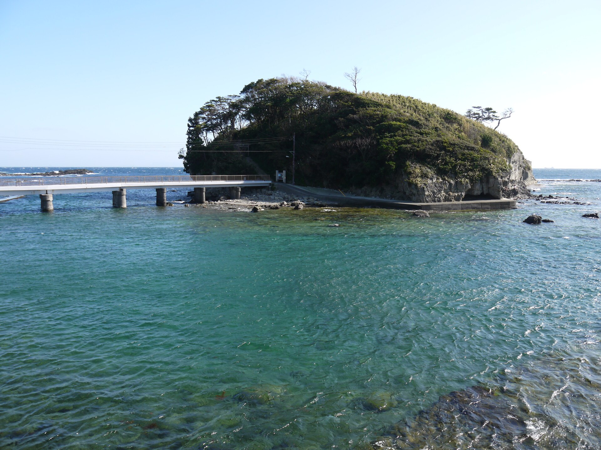

### Rokkosaki Lighthouse (禄剛埼灯台)

Rokkosaki Lighthouse is an exterior-viewing lighthouse in Ishikawa Prefecture. It remains a useful coastal marker and scenic stop even though tower entry is not available, and it is often visited as part of a broader headland or island route.

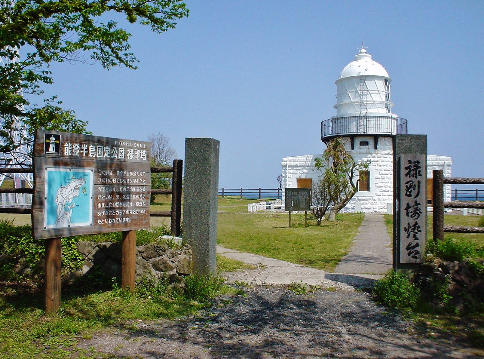

## Iwate Prefecture

### Rikuchu Kurosaki Lighthouse (陸中黒埼灯台)

Rikuchu Kurosaki Lighthouse is an exterior-viewing lighthouse in Iwate Prefecture. It remains a useful coastal marker and scenic stop even though tower entry is not available, and it is often visited as part of a broader headland or island route.

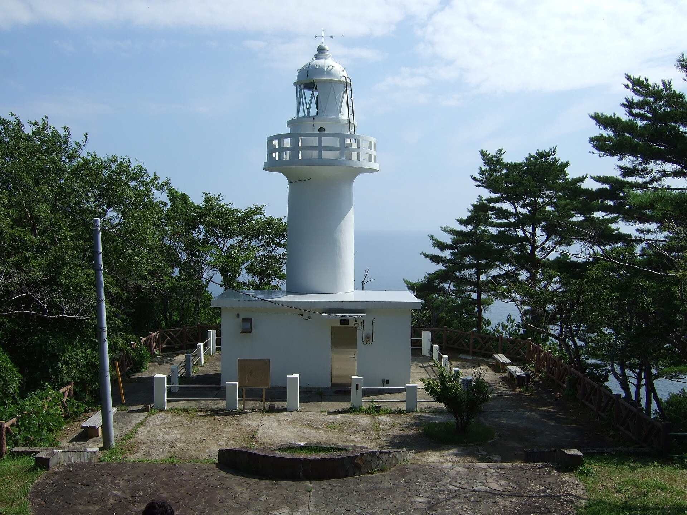

### Todogasaki Lighthouse (魹ヶ埼灯台)

Todogasaki Lighthouse is an exterior-viewing lighthouse in Iwate Prefecture. It remains a useful coastal marker and scenic stop even though tower entry is not available, and it is often visited as part of a broader headland or island route.

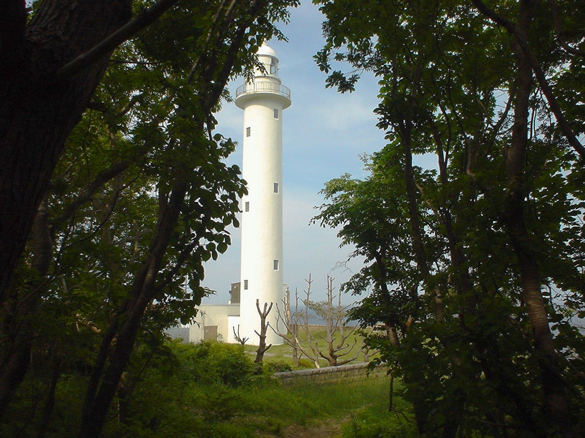

## Kagawa Prefecture

### Ogijima Lighthouse (男木島灯台)

Ogijima Lighthouse is an exterior-viewing lighthouse in Kagawa Prefecture. It remains a useful coastal marker and scenic stop even though tower entry is not available, and it is often visited as part of a broader headland or island route.

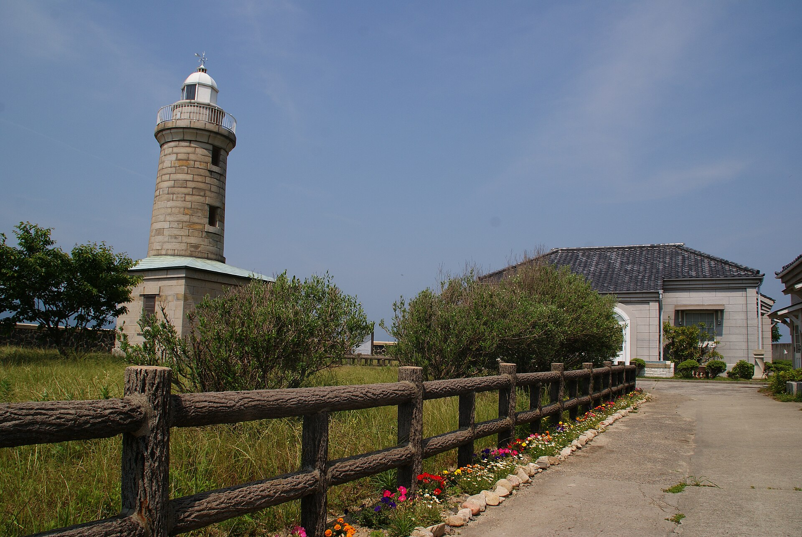

## Kagoshima Prefecture

### Iojimazaki Lighthouse (硫黄島埼灯台)

Iojimazaki Lighthouse is an exterior-viewing lighthouse in Kagoshima Prefecture. It remains a useful coastal marker and scenic stop even though tower entry is not available, and it is often visited as part of a broader headland or island route.

### Satamisaki Lighthouse (佐多岬灯台)

Satamisaki Lighthouse is an exterior-viewing lighthouse in Kagoshima Prefecture. It remains a useful coastal marker and scenic stop even though tower entry is not available, and it is often visited as part of a broader headland or island route.

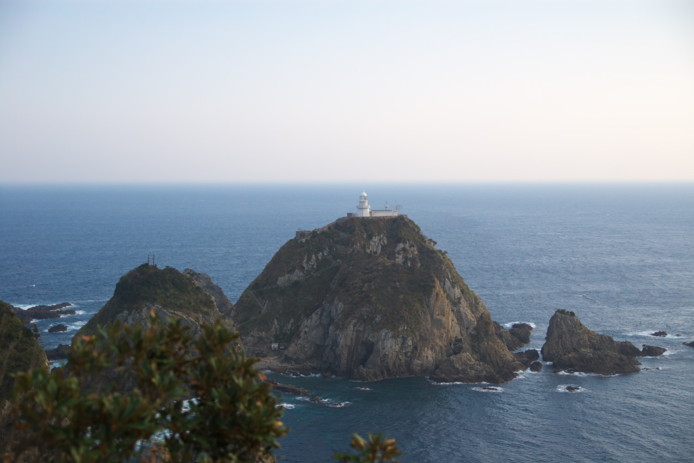

## Kanagawa Prefecture

### Shirasu Lighthouse (白洲灯台)

Shirasu Lighthouse is an exterior-viewing lighthouse in Kanagawa Prefecture. It remains a useful coastal marker and scenic stop even though tower entry is not available, and it is often visited as part of a broader headland or island route.

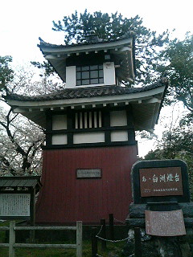

## Kochi Prefecture

### Ashizuri Cape Lighthouse (足摺岬灯台)

Ashizuri Cape Lighthouse is an exterior-viewing lighthouse in Kochi Prefecture. It remains a useful coastal marker and scenic stop even though tower entry is not available, and it is often visited as part of a broader headland or island route.

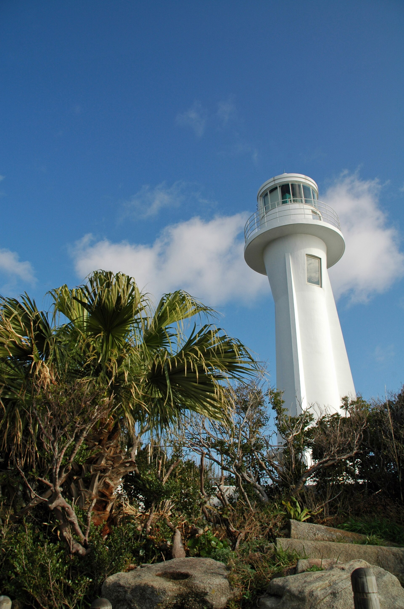

### Muroto Cape Lighthouse (室戸岬灯台)

Muroto Cape Lighthouse is an exterior-viewing lighthouse in Kochi Prefecture. It remains a useful coastal marker and scenic stop even though tower entry is not available, and it is often visited as part of a broader headland or island route.

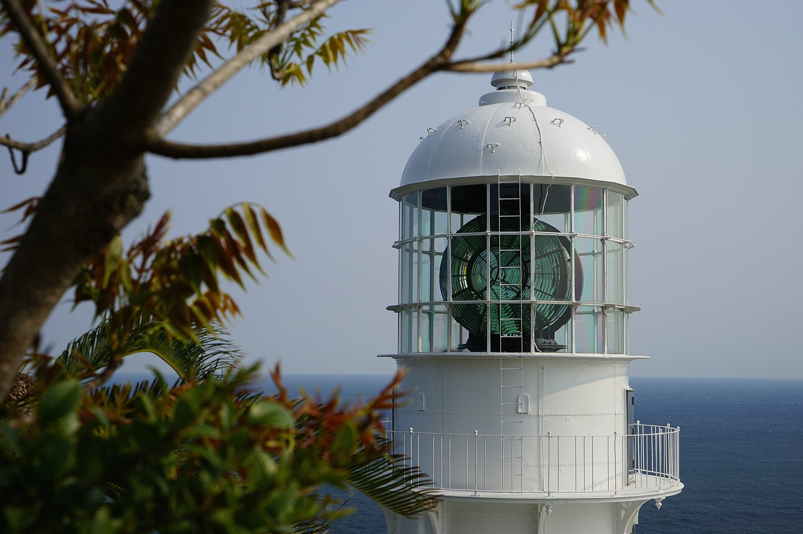

## Kyoto Prefecture

### Kyogamisaki Lighthouse (経ヶ岬灯台)

Kyogamisaki Lighthouse is an exterior-viewing lighthouse in Kyoto Prefecture. It remains a useful coastal marker and scenic stop even though tower entry is not available, and it is often visited as part of a broader headland or island route.

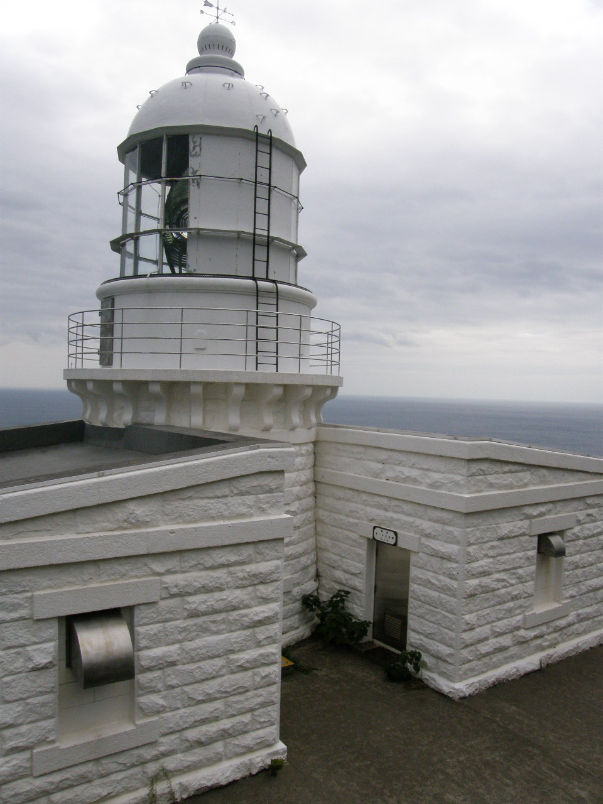

## Mie Prefecture

### Sugashima Lighthouse (菅島灯台)

Sugashima Lighthouse is an exterior-viewing lighthouse in Mie Prefecture. It remains a useful coastal marker and scenic stop even though tower entry is not available, and it is often visited as part of a broader headland or island route.

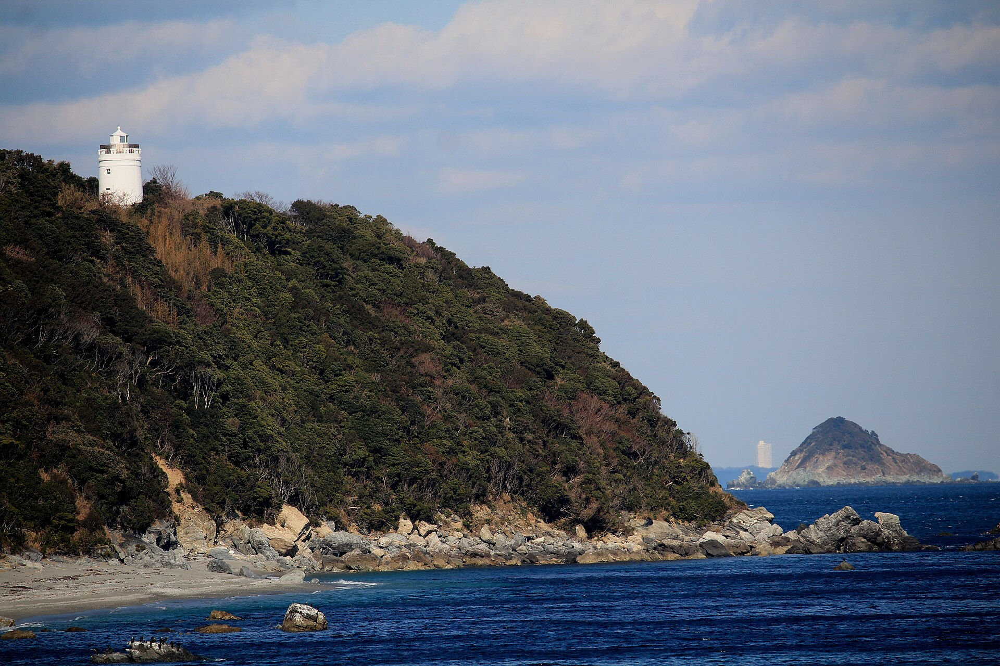

## Miyagi Prefecture

### Kinkasan Lighthouse (金華山灯台)

Kinkasan Lighthouse is an exterior-viewing lighthouse in Miyagi Prefecture. It remains a useful coastal marker and scenic stop even though tower entry is not available, and it is often visited as part of a broader headland or island route.

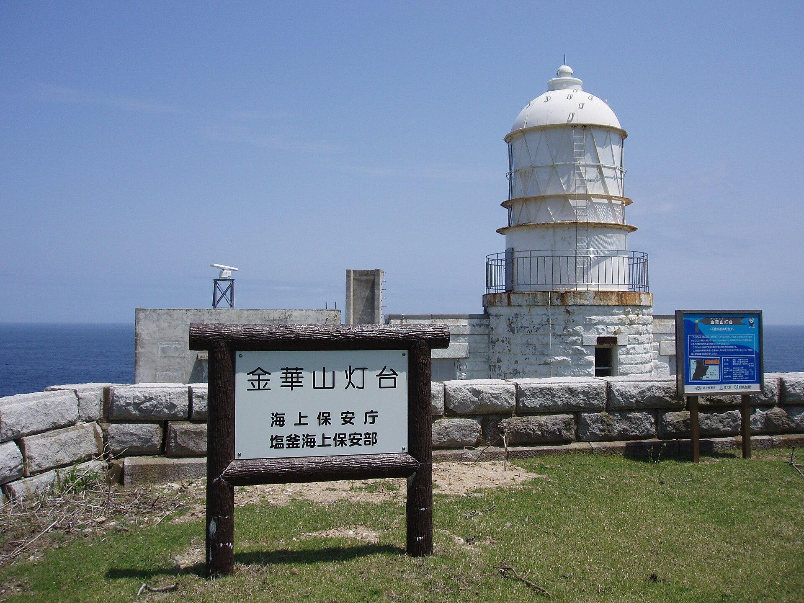

## Nagasaki Prefecture

### Mekejima Lighthouse (女島灯台)

Mekejima Lighthouse is an exterior-viewing lighthouse in Nagasaki Prefecture. It remains a useful coastal marker and scenic stop even though tower entry is not available, and it is often visited as part of a broader headland or island route.

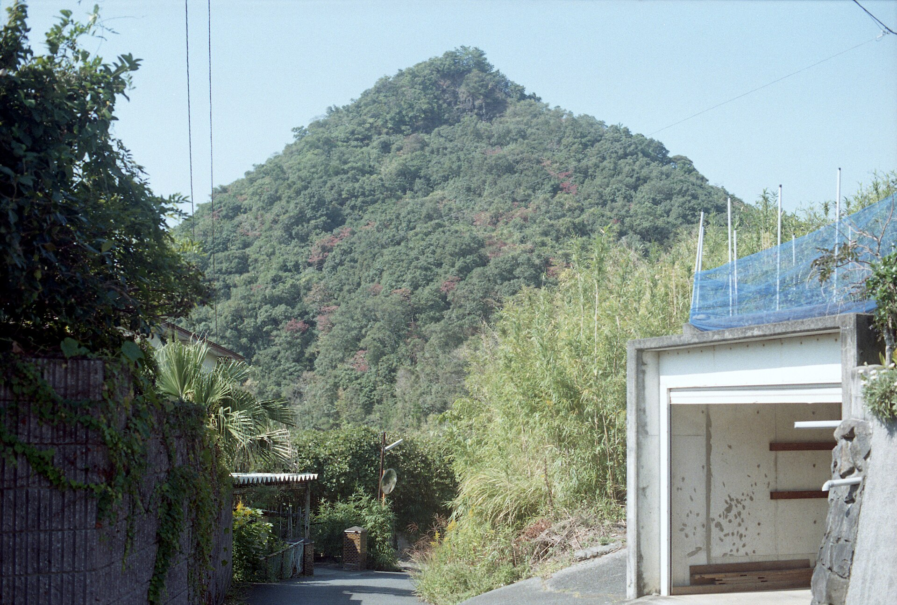

### Ogami Lighthouse (男神島灯台)

Ogami Lighthouse is an exterior-viewing lighthouse in Nagasaki Prefecture. It remains a useful coastal marker and scenic stop even though tower entry is not available, and it is often visited as part of a broader headland or island route.

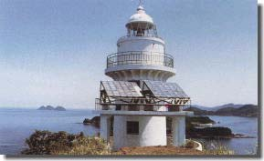

### Osezaki Lighthouse (大瀬埼灯台)

Osezaki Lighthouse is an exterior-viewing lighthouse in Nagasaki Prefecture. It remains a useful coastal marker and scenic stop even though tower entry is not available, and it is often visited as part of a broader headland or island route.

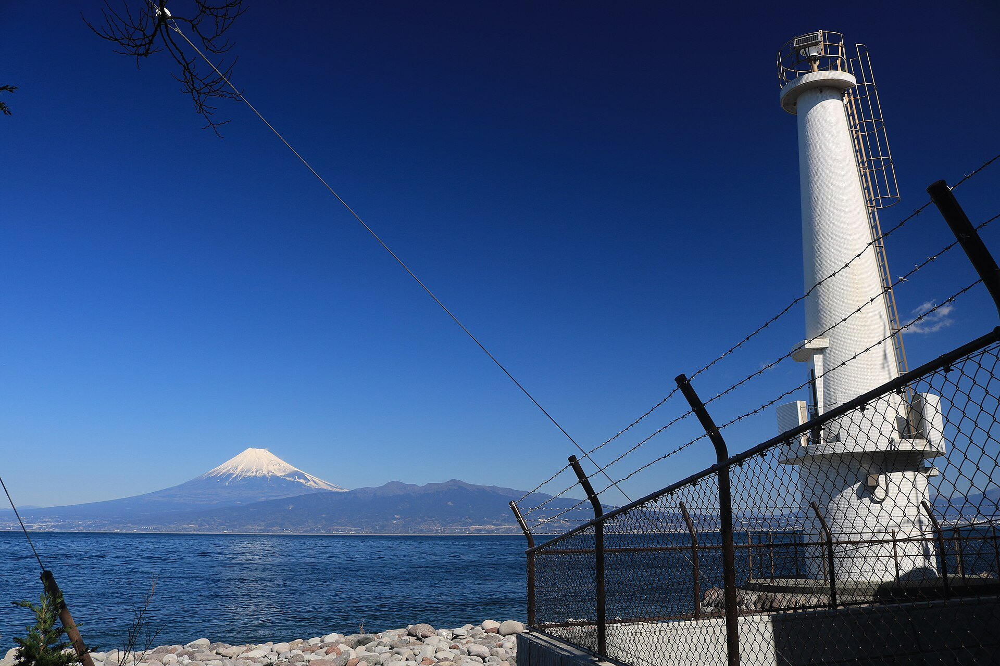

### Tsurushima Lighthouse (鶴島灯台)

Tsurushima Lighthouse is an exterior-viewing lighthouse in Nagasaki Prefecture. It remains a useful coastal marker and scenic stop even though tower entry is not available, and it is often visited as part of a broader headland or island route.

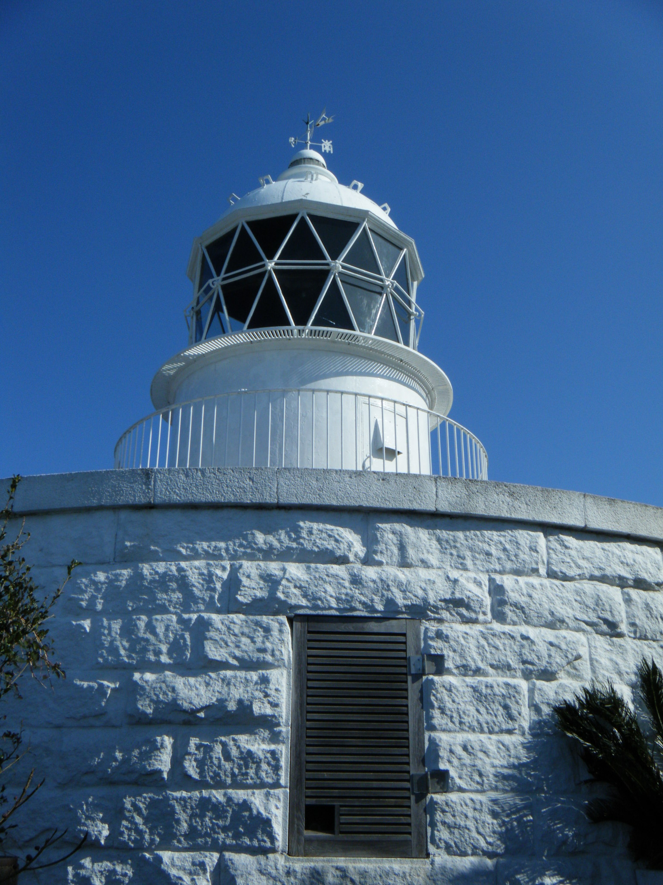

## Niigata Prefecture

### Himesaki Lighthouse (姫埼灯台)

Himesaki Lighthouse is an exterior-viewing lighthouse in Niigata Prefecture. It remains a useful coastal marker and scenic stop even though tower entry is not available, and it is often visited as part of a broader headland or island route.

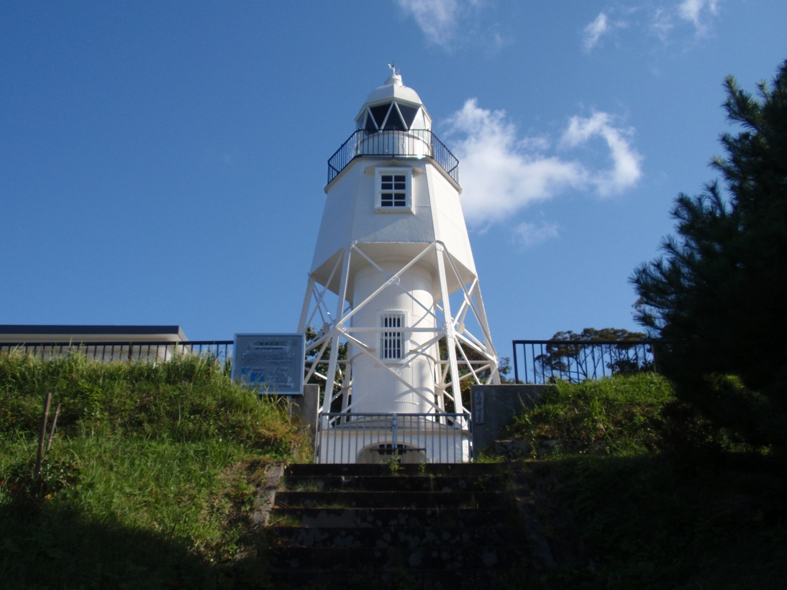

## Oita Prefecture

### Mizunokojima Lighthouse (水ノ子島灯台)

Mizunokojima Lighthouse is an exterior-viewing lighthouse in Oita Prefecture. It remains a useful coastal marker and scenic stop even though tower entry is not available, and it is often visited as part of a broader headland or island route.

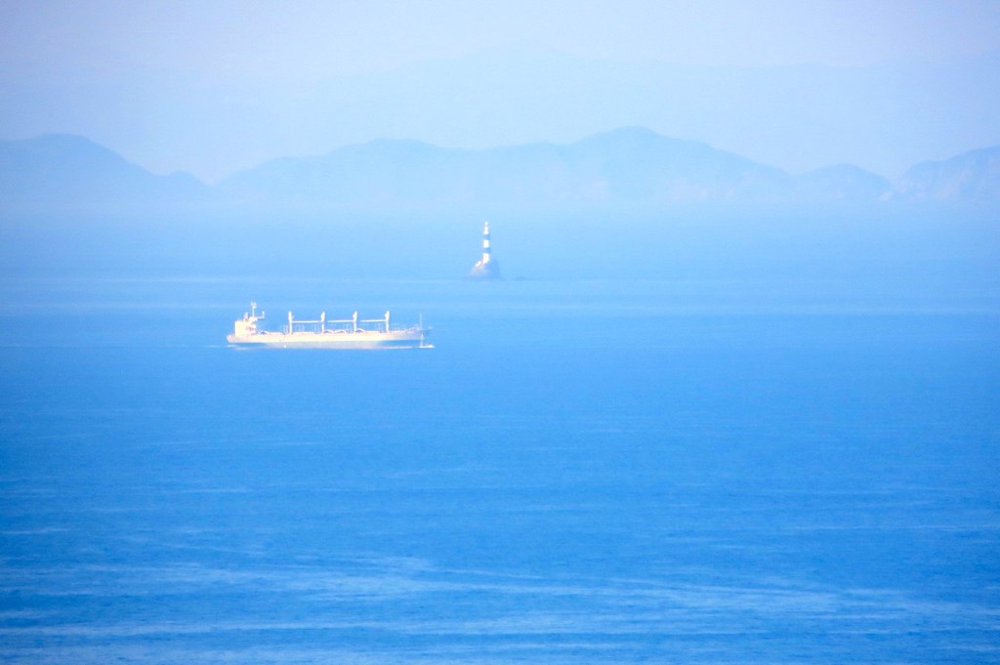

## Osaka Prefecture

### Old Sakai Lighthouse (旧堺燈台)

Old Sakai Lighthouse is an exterior-viewing lighthouse in Osaka Prefecture. It remains a useful coastal marker and scenic stop even though tower entry is not available, and it is often visited as part of a broader headland or island route.

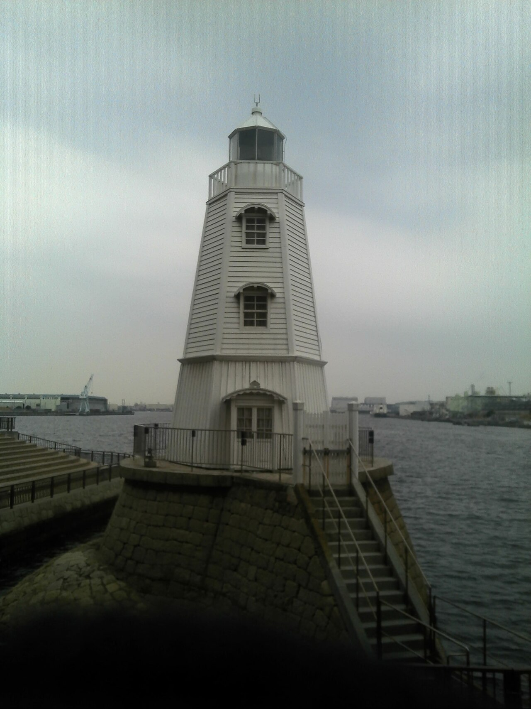

## Shimane Prefecture

### Mihonoseki Lighthouse (美保関灯台)

Mihonoseki Lighthouse is an exterior-viewing lighthouse in Shimane Prefecture. It remains a useful coastal marker and scenic stop even though tower entry is not available, and it is often visited as part of a broader headland or island route.

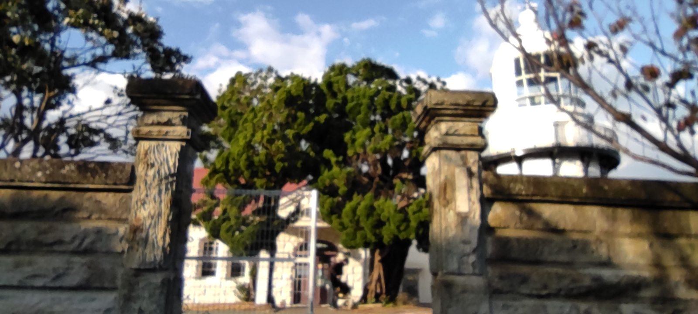

## Shizuoka Prefecture

### Irozaki Lighthouse (石廊埼灯台)

Irozaki Lighthouse is an exterior-viewing lighthouse in Shizuoka Prefecture. It remains a useful coastal marker and scenic stop even though tower entry is not available, and it is often visited as part of a broader headland or island route.

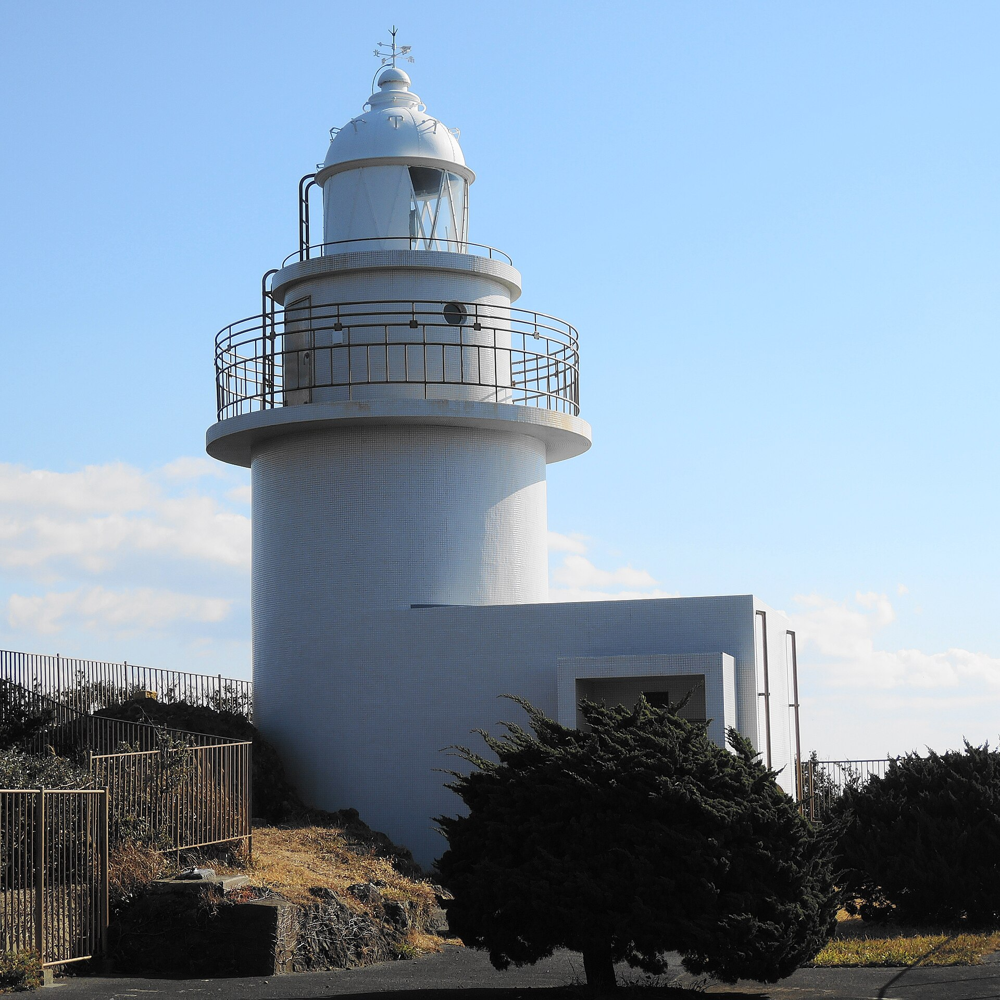

### Mikomotoshima Lighthouse (神子元島灯台)

Mikomotoshima Lighthouse is an exterior-viewing lighthouse in Shizuoka Prefecture. It remains a useful coastal marker and scenic stop even though tower entry is not available, and it is often visited as part of a broader headland or island route.

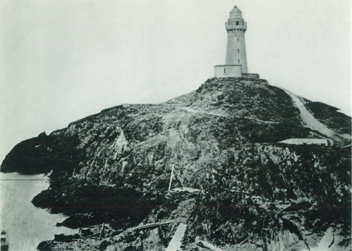

## Tokyo

### Shinagawa Lighthouse (品川燈台)

Shinagawa Lighthouse is an exterior-viewing lighthouse in Tokyo. It remains a useful coastal marker and scenic stop even though tower entry is not available, and it is often visited as part of a broader headland or island route.

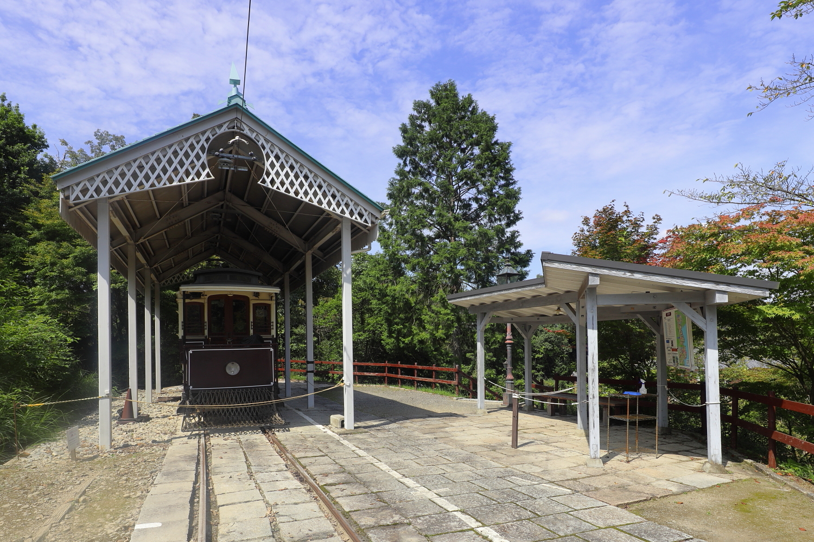

## Wakayama Prefecture

### Kashinosaki Lighthouse (樫野埼灯台)

Kashinosaki Lighthouse is an exterior-viewing lighthouse in Wakayama Prefecture. It remains a useful coastal marker and scenic stop even though tower entry is not available, and it is often visited as part of a broader headland or island route.

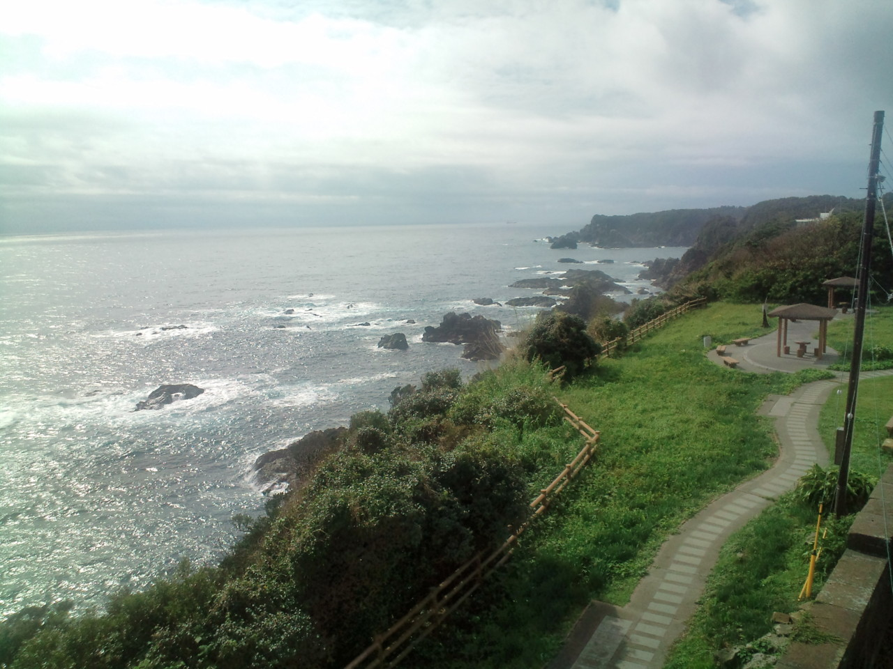

### Tomogashima Lighthouse (友ヶ島灯台)

Tomogashima Lighthouse is an exterior-viewing lighthouse in Wakayama Prefecture. It remains a useful coastal marker and scenic stop even though tower entry is not available, and it is often visited as part of a broader headland or island route.

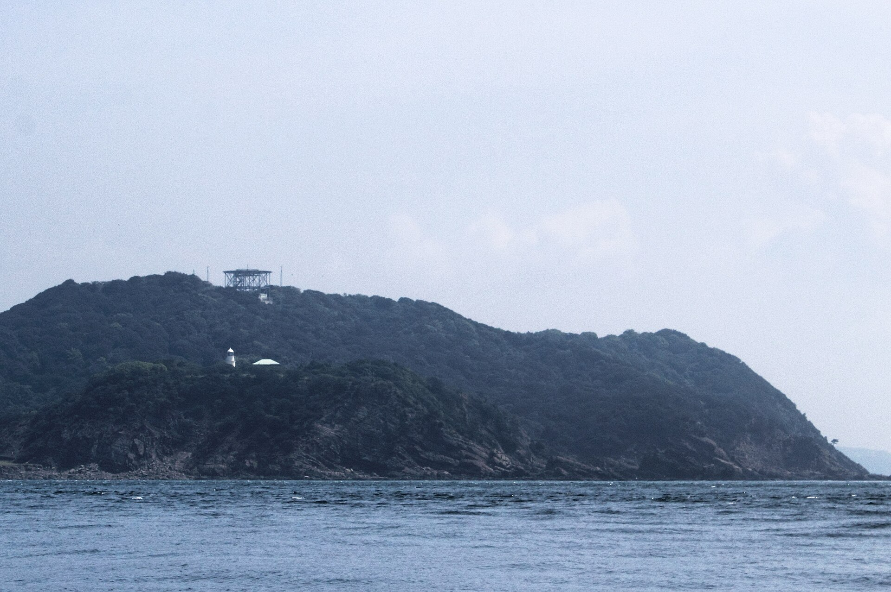

## Yamaguchi Prefecture

### Mutsurejima Lighthouse (六連島灯台)

Mutsurejima Lighthouse is an exterior-viewing lighthouse in Yamaguchi Prefecture. It remains a useful coastal marker and scenic stop even though tower entry is not available, and it is often visited as part of a broader headland or island route.

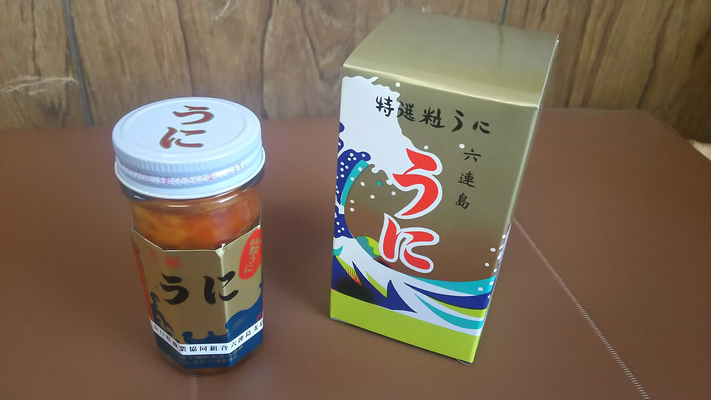

*This consolidated page will be extended as more exterior-only lighthouse photographs are sourced and confirmed.*
