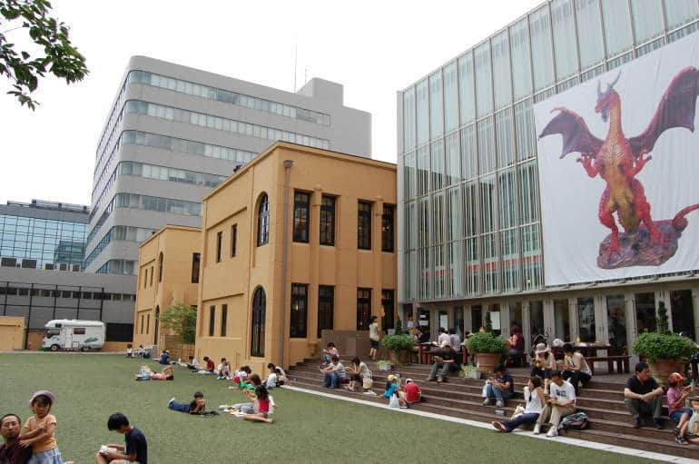
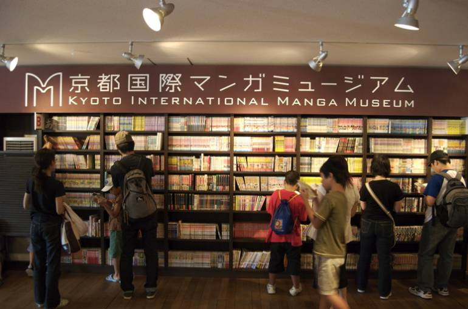
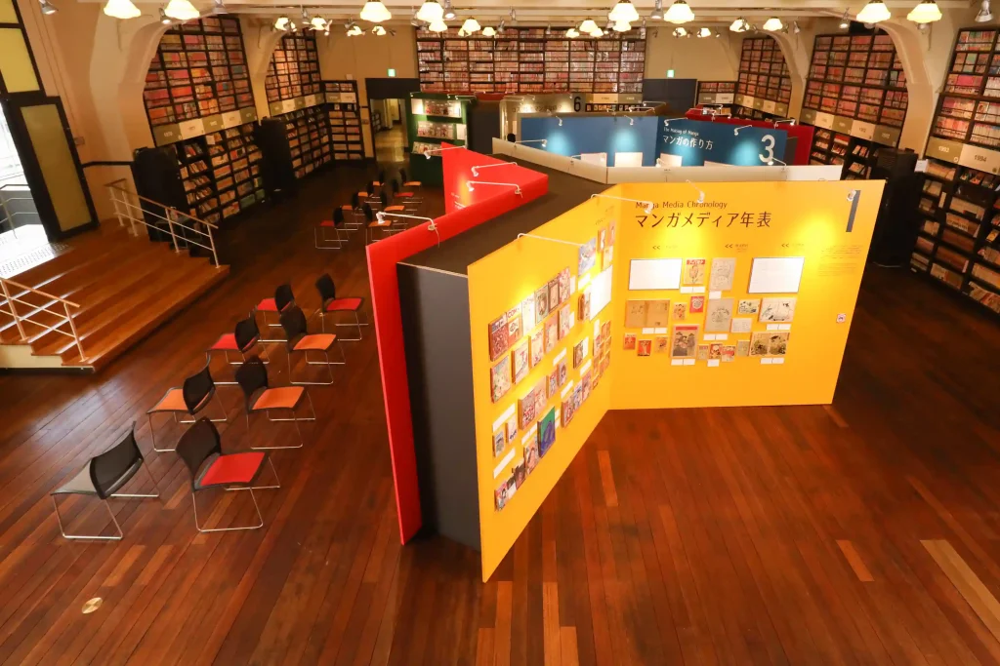

**Kyoto International Manga Museum (Kyoto)**

Kyoto International Manga Museum is a really good stop if you want manga history, archive-style exhibits, and a calmer museum visit instead of a loud shopping-heavy otaku day.

It works well as part of a central Kyoto day, especially if you want to mix pop culture with more traditional sightseeing nearby.

&emsp;&emsp;**Best season/month**

- Year-round; especially handy for indoor planning on rainy or very hot days.

&emsp;&emsp;**Practical note**

- Check temporary exhibitions in advance, since they can change what feels most worth seeing that day.

