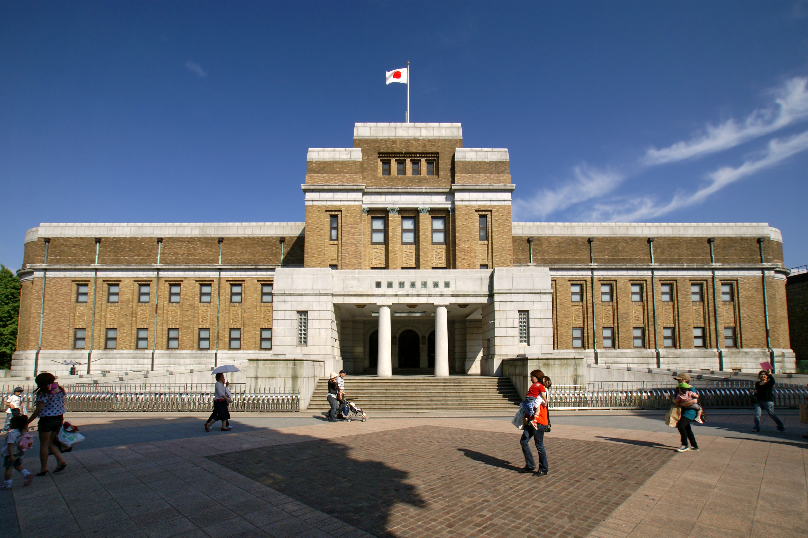

**National Museum of Nature and Science (Ueno, Tokyo)**

National Museum of Nature and Science is one of Tokyo's best museums if you want dinosaurs, natural history, science, and a bit of Japan-specific context in one place.

It works especially well as an easy Ueno stop, and it's a good pick if you want something more hands-on and varied than a traditional art museum.

&emsp;&emsp;**Best season/month**

- Year-round; especially handy on rainy, very hot, or very cold days.

&emsp;&emsp;**Practical note**

- Easy to pair with Ueno Park, Tokyo National Museum, or a full museum-focused day in the area.

