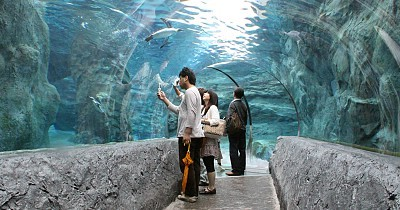

**Asahiyama Zoo**

A very popular zoological garden just outside of central Asahikawa City. Its popularity lies in the enclosures which allow visitors to observe the animals from various angles, many of which are unique to Asahiyama Zoo.

&emsp;&emsp;**Practical info**

- Access: JR from Asahikawa Station to Asahikawayojo, then local bus to the zoo.
- Typical one-way cost from central Asahikawa: JPY 500-900 (train/bus combination).
- Suggested visit time: 2-4 hours.

&emsp;&emsp;**Best season/month**

- December-March for penguin walk and winter atmosphere.
- June-September for comfortable weather and longer daytime.
