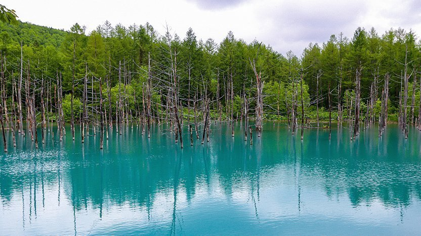
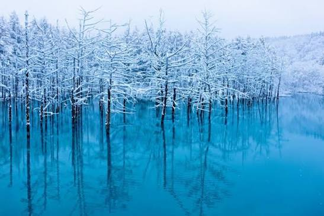
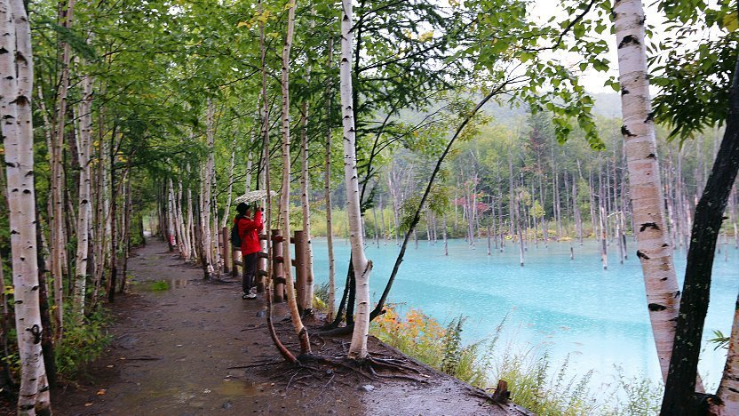
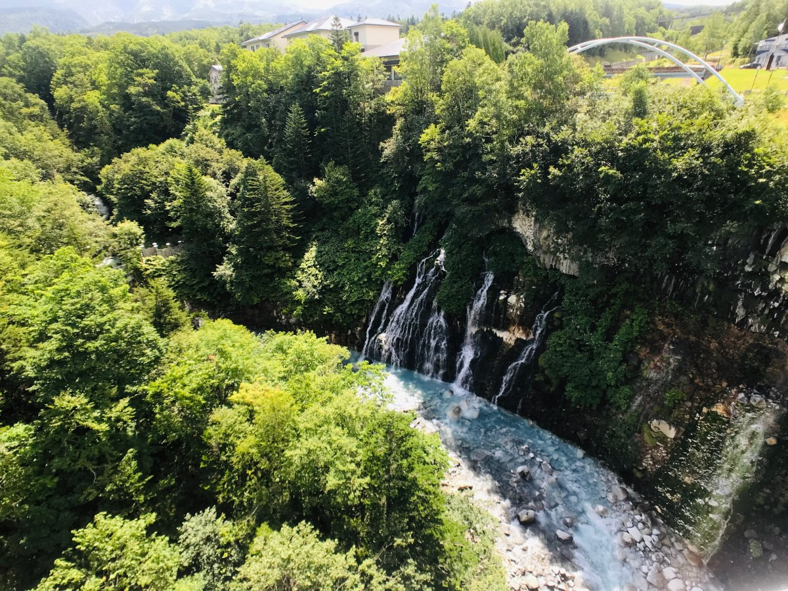

**The Blue Pond**

(Aoiike) outside the hot spring town of Shirogane Onsen is named after its deep blue color which it owes to natural minerals dissolved in the water. Not promoted as a tourist spot until recent years, the pond is part of an erosion control system to prevent damage to Biei in case of an eruption by nearby Mount Tokachidake.

Besides a parking lot, the pond has not seen much touristic development. It takes visitors 5-10 minutes to walk through the forest to the pond. Around the pond there is not much to do other than to enjoy the scenery, which also includes some concrete structures of the erosion control system.

The pond gets lit up on winter evenings from late October to late April (October 25, 2025 to April 23, 2026) from after sunset until 9pm.

Upsteam from the Blue Pond, you'll also get to admire the blue of the Shirahige Falls.

&emsp;&emsp;**Practical info**

- Access: bus or car from Biei Station/Asahikawa Airport area.
- Typical one-way bus fare range: about JPY 500-900 (route-dependent).
- Combine with Shirahige Falls and nearby onsen in one half-day route.

&emsp;&emsp;**Best season/month**

- October-February for stronger color contrast and winter illuminations.
- Early summer for greener surroundings and easier walking paths.
