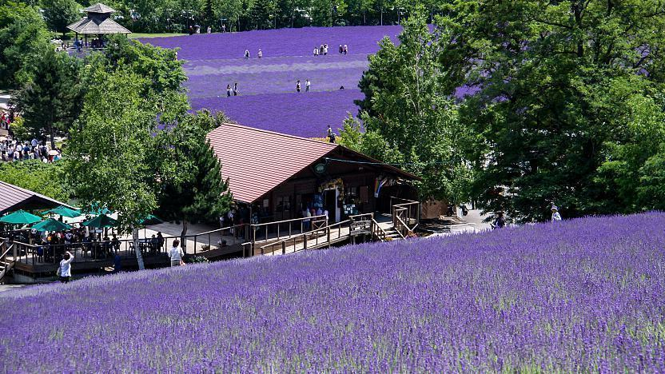
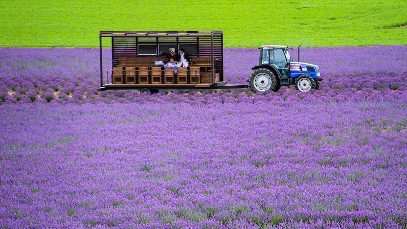
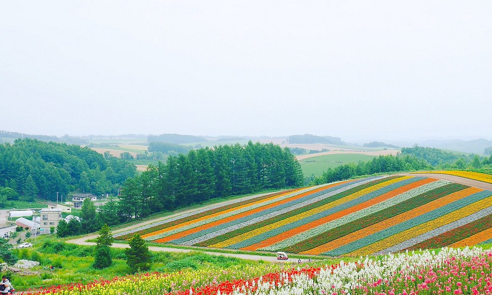

**Furano Flower Fields**

Lavender usually starts blooming in late June and reaches its peak from around mid July to early August. Less numerous, later flowering varieties of lavender remain in bloom into mid August.

Other flowers include rape blossoms, poppies and lupins from June, lilies from July and sunflowers, salvias and cosmos from August and September.

&emsp;&emsp;**Practical info**

- Access: JR Furano Line plus local buses/taxis to major flower farms.
- Typical local transport and entrance-day budget: JPY 1,500-4,000.
- Best to start early to avoid tour-bus crowd peaks.

&emsp;&emsp;**Best season/month**

- Mid July to early August for peak lavender.
- August-September for wider flower variety beyond lavender.
