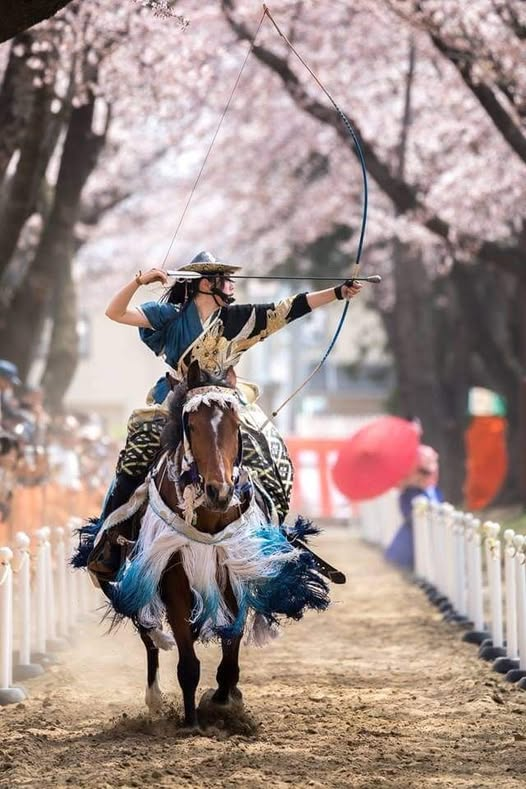

**Sakura Yabusame Festival**

In April features all female horseback archers. Detailed event page: [Sakura Yabusame Festival](../../../../events/festivals/Sakura%20Yabusame%20Festival.md).

&emsp;&emsp;**Practical info**

- Main area: Towada city and nearby Lake Towada access points.
- Access from Hachinohe/Aomori usually requires train plus bus transfer.
- Typical transport budget from major Aomori hubs: JPY 2,000-5,000 one way.

&emsp;&emsp;**Best season/month**

- April for Sakura Yabusame Festival.
- October for autumn foliage around Lake Towada and Oirase Gorge.
