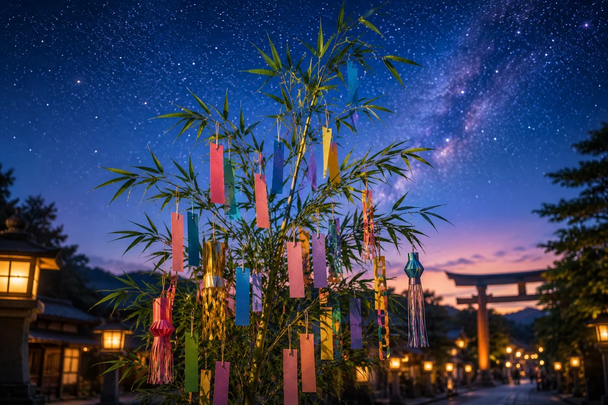
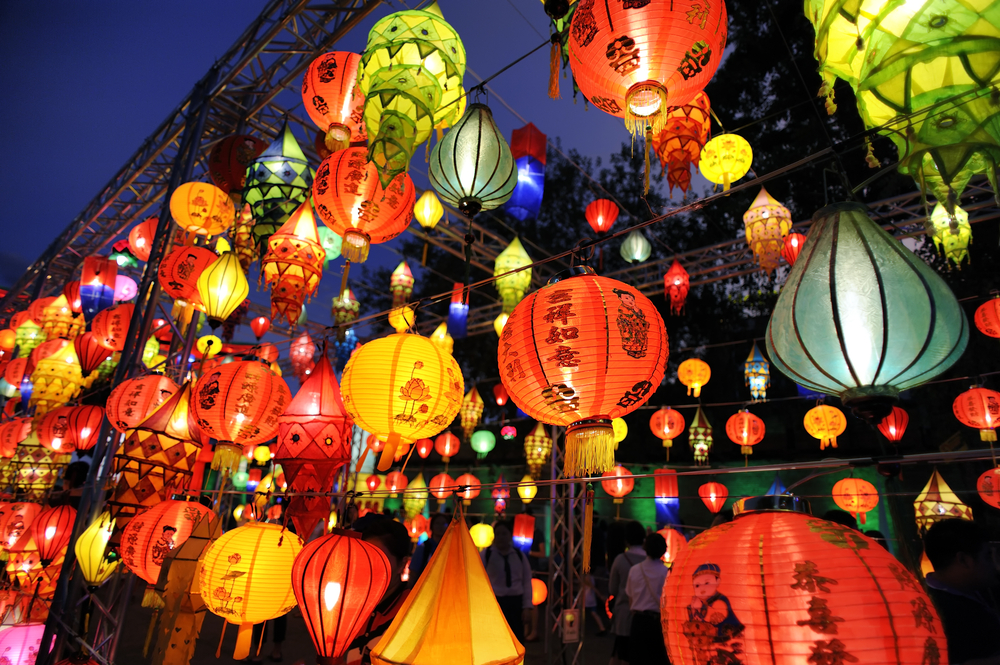

**Ichibancho (Sendai District)**

Ichibancho is Sendai's central arcade district for food, shopping, and festival decorations.

&emsp;&emsp;**Highlights**

- Covered shopping streets
- Local snack and izakaya spots
- Tanabata decorations in August

Event details: [Tanabata Festival](../../../../../../events/festivals/Tanabata%20Festival.md)

&emsp;&emsp;**Best month**

- August for Tanabata atmosphere.
- Year-round for evening food walks.
