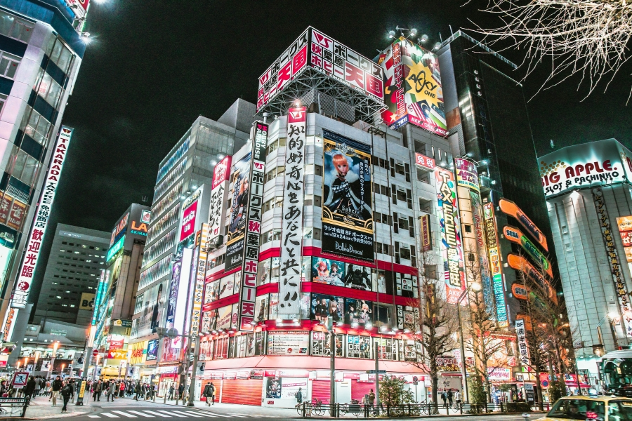
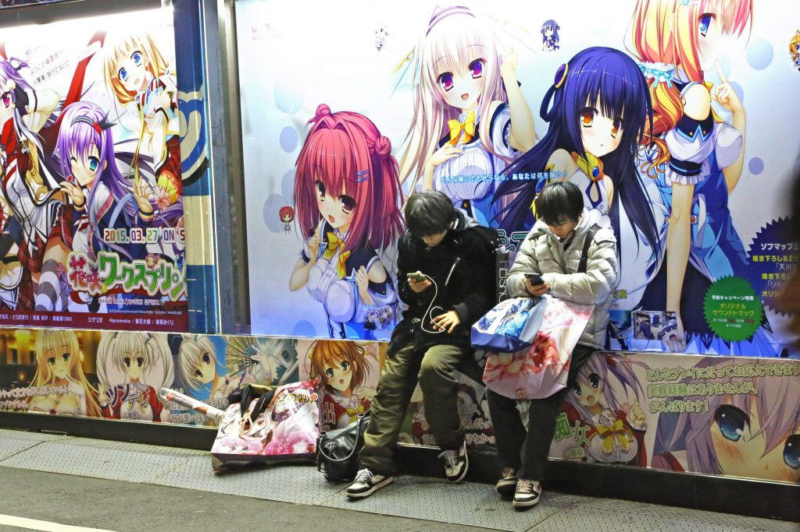
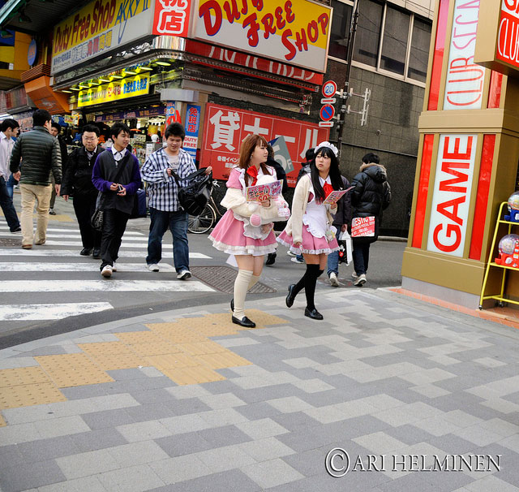

**Akihabara (Tokyo District)**

Akihabara is Tokyo's top area for anime, manga, games, electronics, and themed cafes.

&emsp;&emsp;**What to see (in order)**

- Electric Town exits area (quick orientation walk)
- Multi-floor figure and hobby stores (Radio Kaikan, AmiAmi, Mandarake)
- Retro game shops and arcades (GiGO, Taito Station)
- Kanda Myojin Shrine (short walk, quieter cultural stop)

&emsp;&emsp;**Practical info**

- Access: JR Yamanote/Keihin-Tohoku/Sobu lines to Akihabara Station.
- Typical fare from major hubs: JPY 150-220.
- Best time of day: late morning to evening; weekdays are less crowded.

&emsp;&emsp;**Where to stay nearby**

- Akihabara/Ueno for direct access.
- Asakusa for cheaper hotels and quick metro connections.

&emsp;&emsp;**Best season/month**

- Year-round destination.
- Best comfort months: October-November and March-April.
- Good rainy-day option in June because many attractions are indoors.

