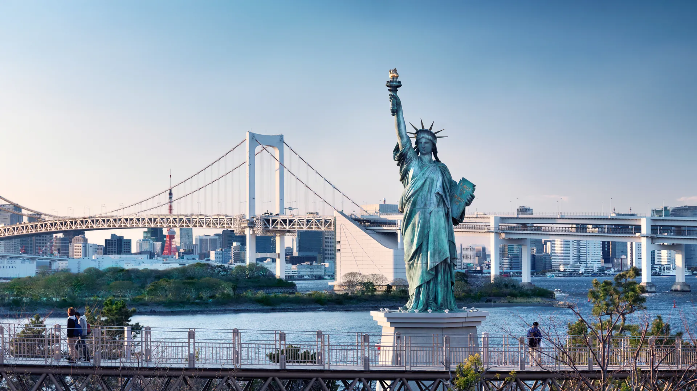

**Odaiba (Tokyo Bay Area District)**

Odaiba is a modern waterfront district; for digital museum details see [teamLab Planets Tokyo](../../../../../museums/teamLab%20Planets%20Tokyo.md). For major nearby tech expo context, see [CEATEC](../../../../../events/misc/CEATEC.md).

&emsp;&emsp;**What to see (in order)**

- teamLab area (if booked)
- DiverCity and bayfront promenade
- Rainbow Bridge and night skyline viewpoints
- Optional: small beach park walk
- [Gundam Base](../../../../themes/otaku/Tokyo%20-%20Odaiba%20Gundam%20Base.md) if interested in Gundam and/or model kits

&emsp;&emsp;**Practical info**

- Access: Yurikamome Line from Shimbashi or Rinkai Line from Osaki/Shinjuku area.
- Typical fare: JPY 330-390 one way from central Tokyo.
- Reserve timed-entry museums in advance.

&emsp;&emsp;**Where to stay nearby**

- Odaiba: comfortable but expensive.
- Shinagawa/Shimbashi: better base for mixed itineraries.

&emsp;&emsp;**Best season/month**

- October-November and April-May for pleasant bay walks.
- Summer evenings are lively but hot/humid.

