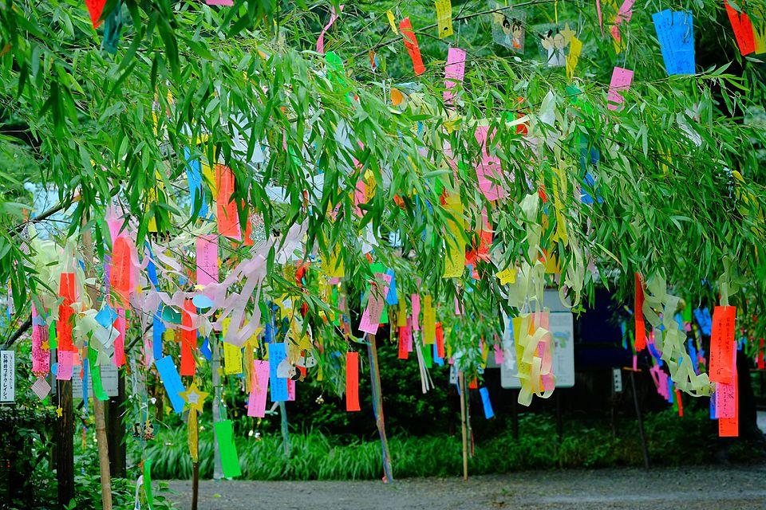
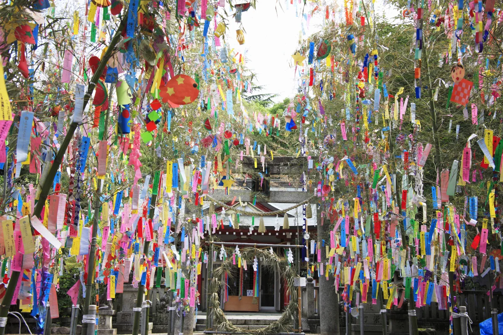

**Echizen Railway (Fukui)**

Echizen Railway is a key local network for reaching coastal and inland stops from central Fukui, including routes useful for Mikuni-side travel.

It is one of the most useful transit options for visitors who want to explore Fukui without driving.

&emsp;&emsp;**Best season/month**

- Year-round; spring and autumn are most comfortable for station-to-town walking.

&emsp;&emsp;**How to use it**

- Start from central Fukui and plan loops around one or two anchor stops.
- Pair rail segments with short local bus or taxi connections where needed.

&emsp;&emsp;**Practical note**

- Frequency varies by time of day, so check return schedules before committing to remote stops.

