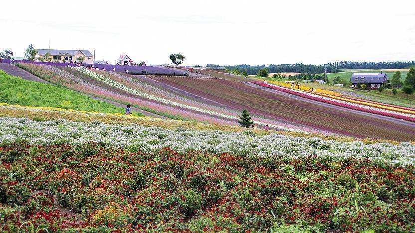
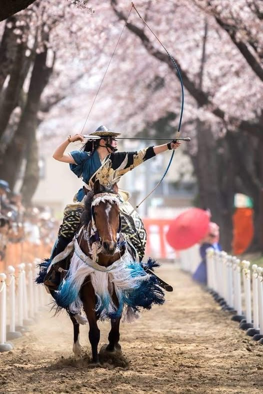
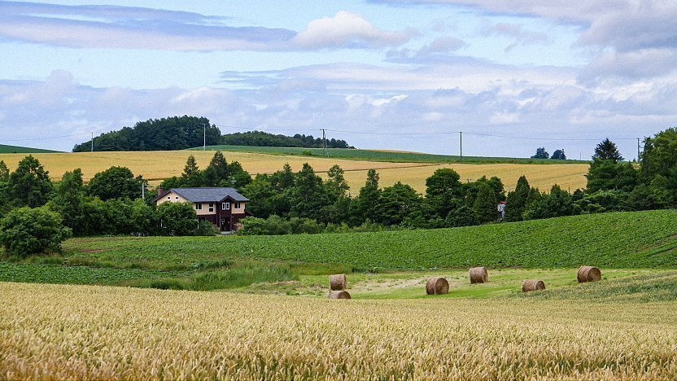

**Keya Kurotatsu Shrine (Fukui Coast Area)**

Keya Kurotatsu Shrine is a quieter local shrine stop in Fukui's coastal zone, best visited as part of a broader scenic drive or rail-and-bus coastal loop.

The atmosphere is more local and less crowded than major urban shrine sites.

&emsp;&emsp;**Best season/month**

- Spring and autumn for mild weather and clearer coastal light.

&emsp;&emsp;**Why include it**

- Adds a quieter shrine experience to a Fukui itinerary.
- Easy to combine with nearby coastal viewpoints and local seafood stops.

&emsp;&emsp;**Practical note**

- Confirm transport timing if you are not driving, since local services can be infrequent.

