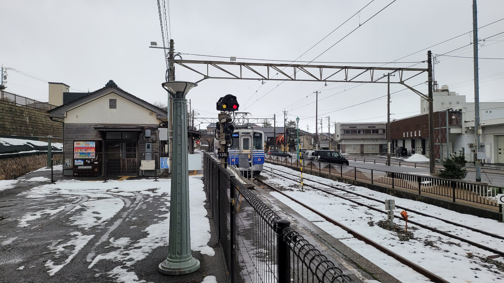
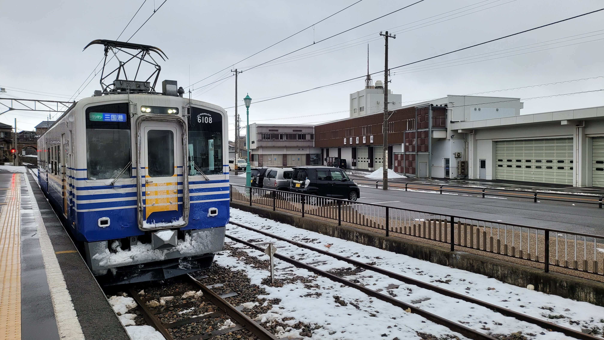
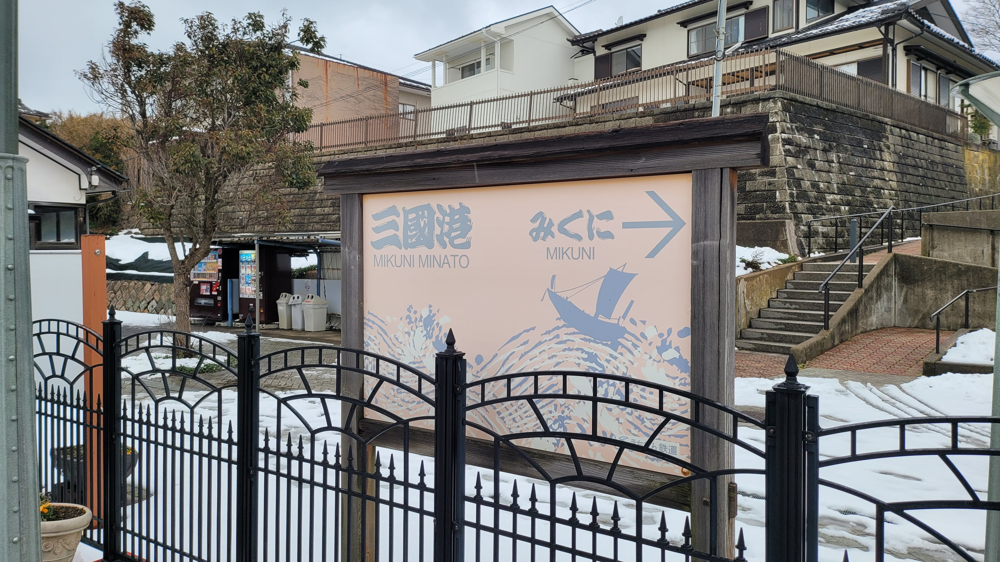
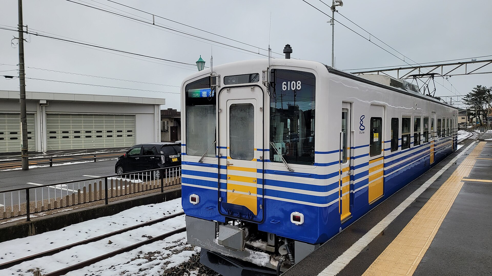

**Mikuni Minato (Fukui)**

Mikuni Minato is a historic port area in Sakai, Fukui, known for old merchant streets, river views, and access to the northern Echizen coast.

It works well as a slower half-day stop when paired with seaside routes and local seafood dining.

&emsp;&emsp;**Best season/month**

- Spring and autumn for comfortable harbor walks.
- Summer for coastal day trips nearby.

&emsp;&emsp;**What to do**

- Walk old port-side lanes and riverfront sections.
- Try seafood-focused local lunch spots.
- Use Mikuni as a base point for Echizen coast continuation.

&emsp;&emsp;**Practical note**

- Transit frequency is lower than central Fukui corridors, so check return times in advance.

