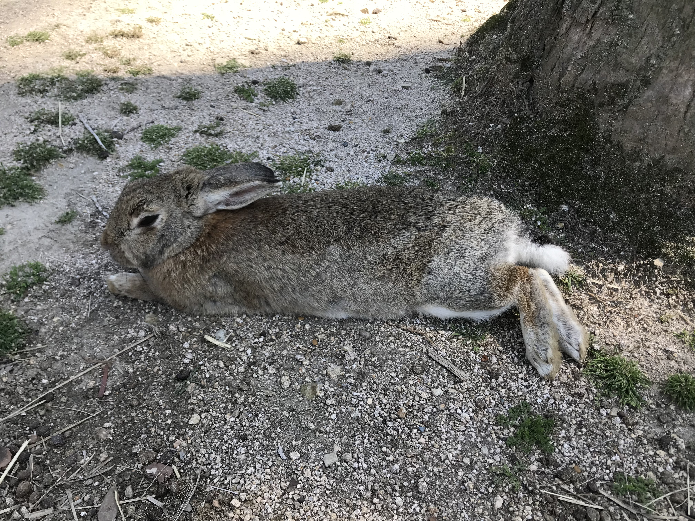
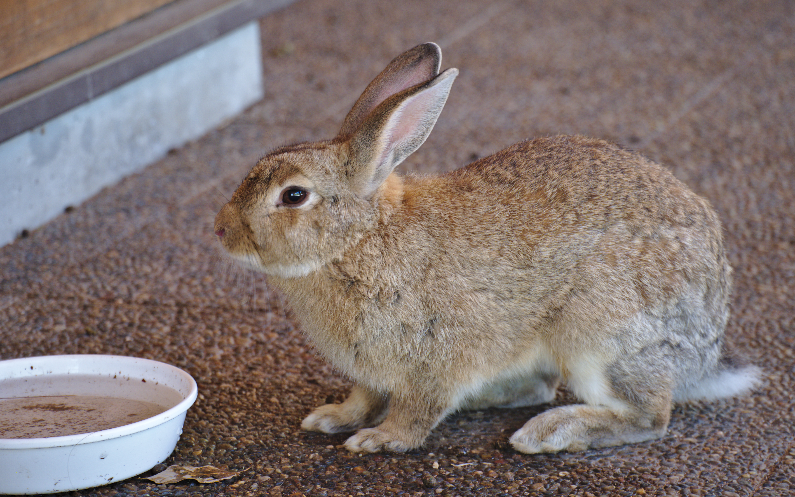

**Okunoshima (Bunny Island)**

Okunoshima, often called Bunny Island, is a small island in the Seto Inland Sea off Takehara in Hiroshima Prefecture. It is known for large numbers of free-roaming rabbits, quiet coastal views, and low-traffic walking routes.

&emsp;&emsp;**Why visit**

- Easy half-day or full-day destination from Hiroshima for nature and photography.
- Scenic island atmosphere with beaches, viewpoints, and relaxed walking paths.
- Distinctive experience for animal lovers, especially compared with city-focused itineraries.

&emsp;&emsp;**Bunny history (short version)**

- During the pre-1945 period, Okunoshima hosted military facilities including a poison gas plant; parts of this history are documented at the island museum today.
- The exact origin of the current rabbit population is not fully documented in one official account, but local tourism sources and reporting generally point to releases in the postwar era followed by natural population growth.
- Over time, rabbits became the island's best-known identity and a major reason visitors come.

&emsp;&emsp;**Current status**

- Okunoshima remains an active tourist destination with regular ferry access from Tadanoumi.
- Rabbit welfare depends on visitor behavior; feeding should be done responsibly and litter should be carried out.
- Rules, ferry schedules, and on-island services can change seasonally, so check current transport and visitor guidance before your trip.

&emsp;&emsp;**Access / practical note**

- Typical route: JR to Tadanoumi Station, short walk to Tadanoumi Port, then ferry to Okunoshima.
- Best in mild weather (spring and autumn) for comfortable walking and better photo conditions.
