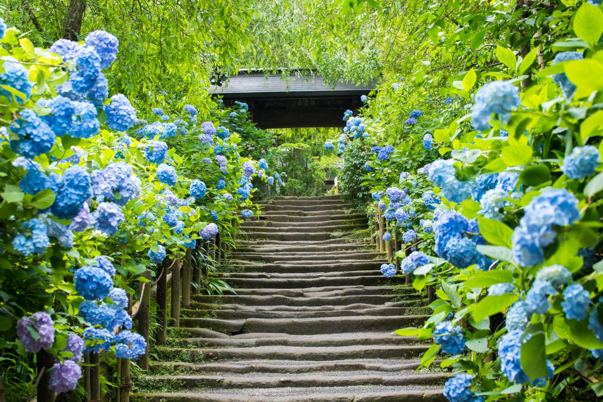
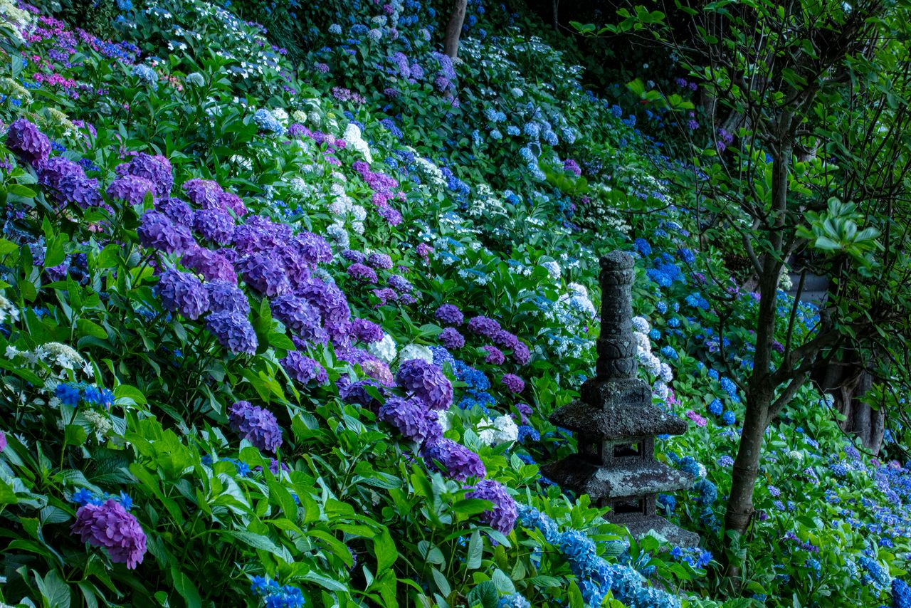

**Heisenji Temple / Heisenji Hakusan Shrine (Katsuyama, Fukui)**

Heisenji is a historic sacred complex in Katsuyama, often highlighted for moss-covered grounds, cedar forest atmosphere, and mountain spirituality.

It is one of Fukui's best temple-and-shrine heritage stops, especially when paired with Katsuyama routes.

&emsp;&emsp;**Best season/month**

- Late spring to autumn for easier trail conditions.
- Early morning for the calmest atmosphere.

&emsp;&emsp;**Why it stands out**

- Distinctive moss scenery and cedar-lined historical setting.
- Strong option for travelers interested in quieter sacred sites.

&emsp;&emsp;**Practical note**

- Best combined with a Katsuyama day plan, including local museums or nature stops.

