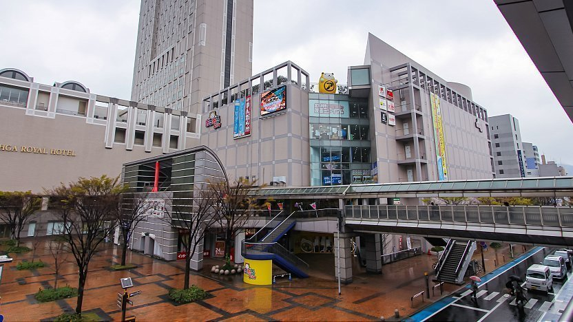
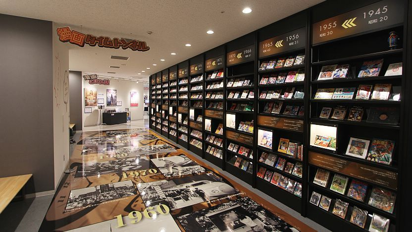

**Fukuoka - Kokura Manga Zone**

Kokura (Kitakyushu area) is a useful Kyushu otaku stop, known for manga culture touchpoints and a practical city-center layout.

&emsp;**Best For**

- Otaku-focused day trip while based in Fukuoka
- Manga museum-style visits in Kyushu
- Combining local food and shopping in one district

&emsp;**Suggested Half-Day Route**

- Kokura Station area arrival
- Manga-focused museum or exhibit stop
- River/castle area walk and shopping streets

&emsp;**Practical Notes**

- Best combined with an overnight in Fukuoka City
- Verify opening days for museum/exhibit venues before planning
- Works well as a weather-proof urban alternative

&emsp;**City-to-City Routing**

- Best inbound stop: Hakata to Kokura by JR (common day-trip pattern)
- Next same-day stop: Kokura station area shopping streets or return to Hakata
- Best long-distance continuation: fly from Fukuoka or rail back toward Kansai/Tokyo

&emsp;**Budget Guidance**

- Tight: day-trip from Fukuoka with low-cost meals and limited shopping
- Medium: include museum entry plus one planned merch purchase
- Relaxed: premium meals, flexible timing, and broader collectible budget

&emsp;**Pair With**

- [Tokyo - Akihabara](Tokyo%20-%20Akihabara.md)
- [Tokyo Game Show](../../../events/otaku/Tokyo%20Game%20Show.md)

