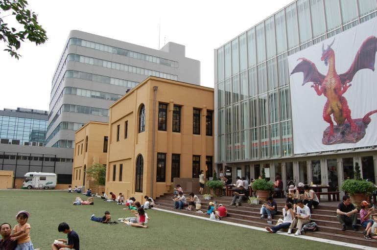
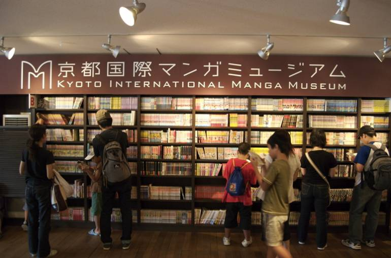
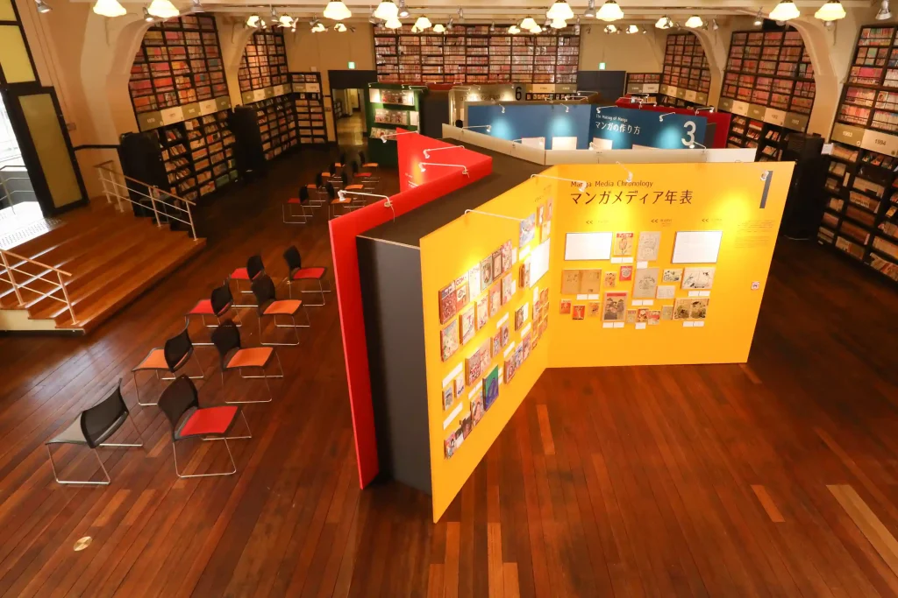

**Kyoto - Kyoto International Manga Museum**

Kyoto International Manga Museum is a strong culture-and-history stop for travelers who want context, archives, and curated manga exhibitions.

&emsp;**Best For**

- Manga history and publishing context
- Quieter, museum-style otaku visits
- Travelers balancing temples and pop culture

&emsp;**Suggested Half-Day Route**

- Museum entry and core exhibitions
- Reading wall and archive browsing
- Nearby central Kyoto walk

&emsp;**Practical Notes**

- Check temporary exhibition schedules in advance
- This is a better daytime plan than late-evening plan
- Pair with nearby cultural sites for efficient routing

&emsp;**City-to-City Routing**

- Best inbound stop: from Osaka by JR/rapid train to central Kyoto
- Next same-day stop: central Kyoto cultural districts
- Best onward city transfer: Osaka for flights/rail hub, or Nagoya/Tokyo by Shinkansen

&emsp;**Budget Guidance**

- Tight: museum-first day with simple local meals
- Medium: museum plus one nearby paid cultural site
- Relaxed: add premium kaiseki/dining and curated bookstore purchases

&emsp;**Pair With**

- [Osaka - Nipponbashi Den Den Town](Osaka%20-%20Nipponbashi%20Den%20Den%20Town.md)
- [Tokyo - Nakano Broadway](Tokyo%20-%20Nakano%20Broadway.md)

