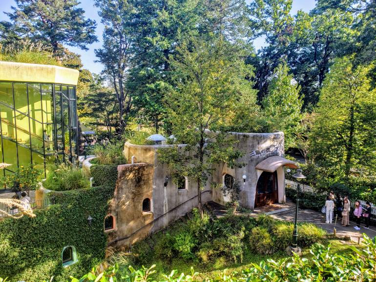
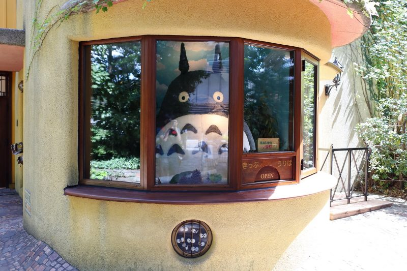
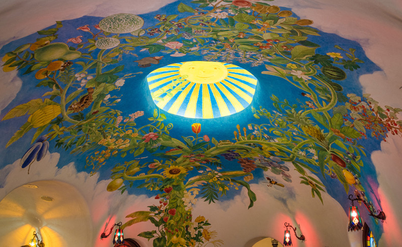
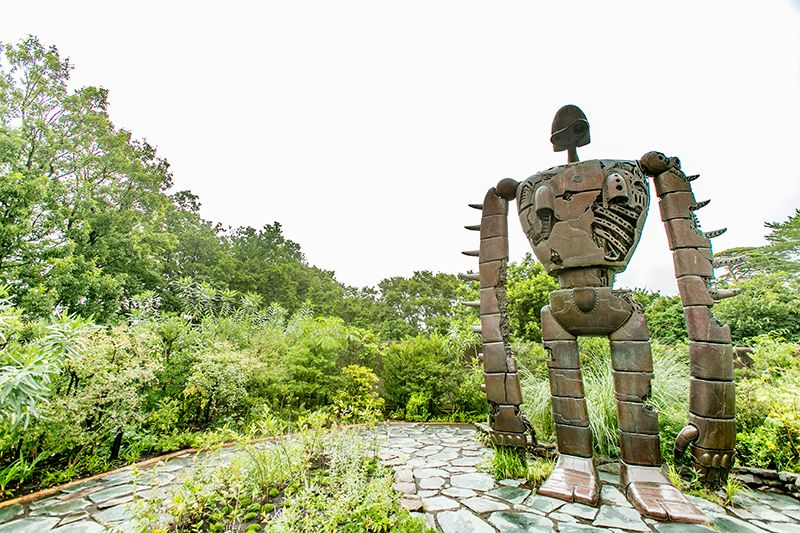

**Mitaka - Ghibli Museum**

This theme page points to the canonical museum guide to avoid duplicate planning content.

&emsp;**Main Reference**

- [Ghibli Museum (Mitaka, Tokyo)](../../../museums/Ghibli%20Museum.md)

&emsp;**Pair With**

- [Tokyo - Nakano Broadway](Tokyo%20-%20Nakano%20Broadway.md)
- [Tokyo - Ikebukuro](Tokyo%20-%20Ikebukuro.md)

