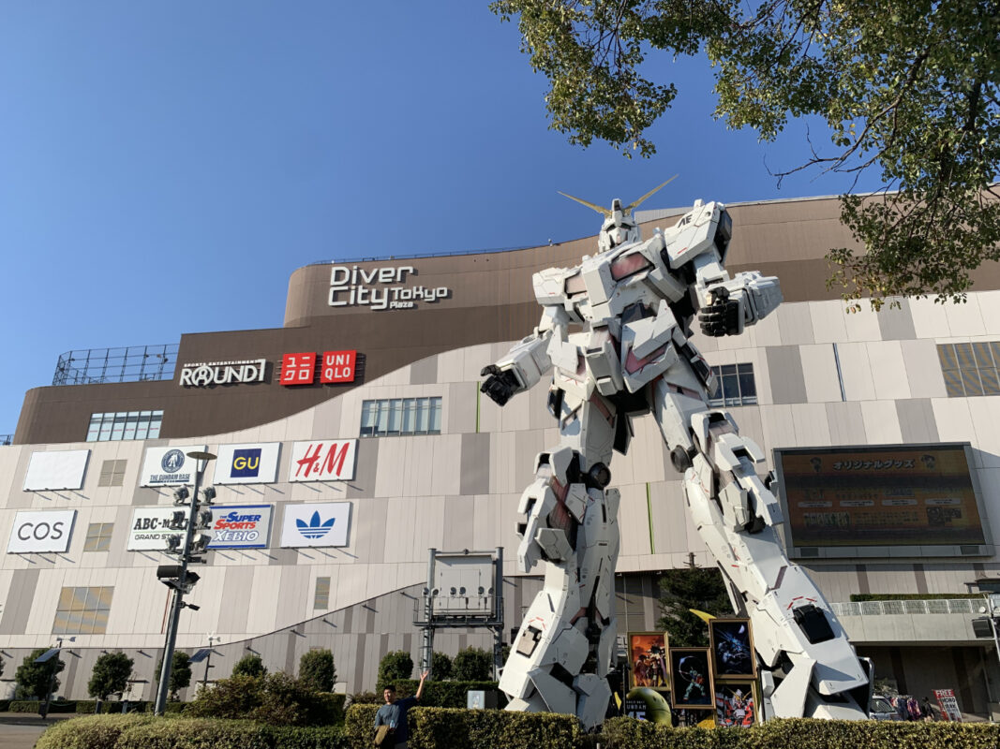
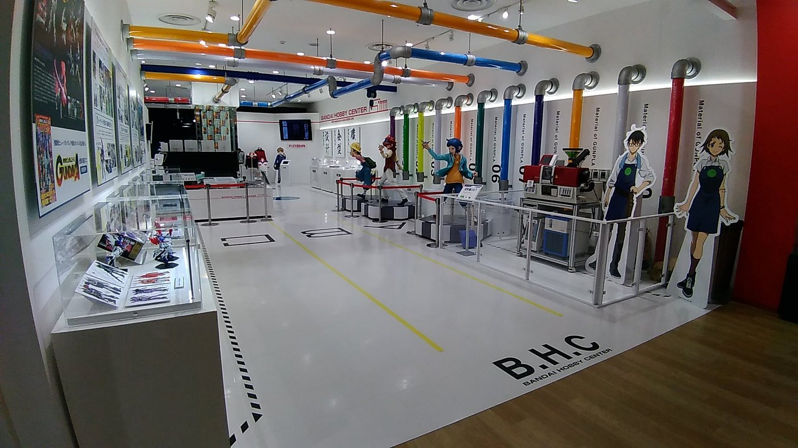
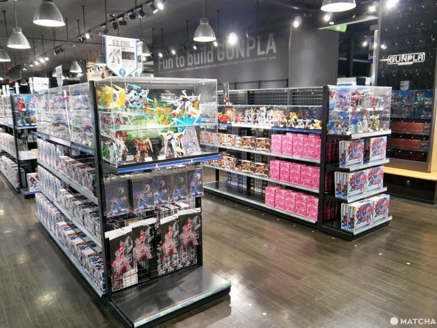
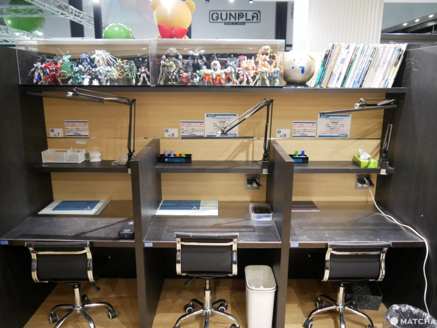

**Tokyo - Odaiba Gundam Base**

Odaiba is one of Tokyo's strongest mecha-focused stops, centered on Gundam displays, model-kit shopping, and waterfront entertainment complexes.

&emsp;**Best For**

- Gundam fans and Gunpla shoppers
- First-time otaku visitors who want easy-access major attractions
- Mixed groups (otaku + non-otaku) in one district

&emsp;**Otaku Highlights**

- Life-size Gundam statue photo sessions (day and night lighting differ)
- Gundam Base Tokyo for model kits, exclusives, and displays
- Nearby hobby/figure floors inside Odaiba complexes

&emsp;**Suggested Half-Day Flow**

- Arrive before midday for lighter lines at key stores
- Gundam statue + Gundam Base block
- Late-afternoon bay walk and evening skyline photos

&emsp;**Practical Notes**

- Peak crowds: weekends, holidays, and school breaks
- Some stores/entries use timed slots or queue systems
- Check official pages on the same day for event-only closures

&emsp;**Location Reference**
- [Odaiba (Tokyo Bay Area District)](../../regions/3.%20Kanto/Tokyo/Districts/Odaiba.md)

&emsp;**Pair With**

- [Tokyo - Akihabara](Tokyo%20-%20Akihabara.md)
- [Tokyo - Ikebukuro](Tokyo%20-%20Ikebukuro.md)
- [Tokyo Game Show](../../../events/otaku/Tokyo%20Game%20Show.md)

