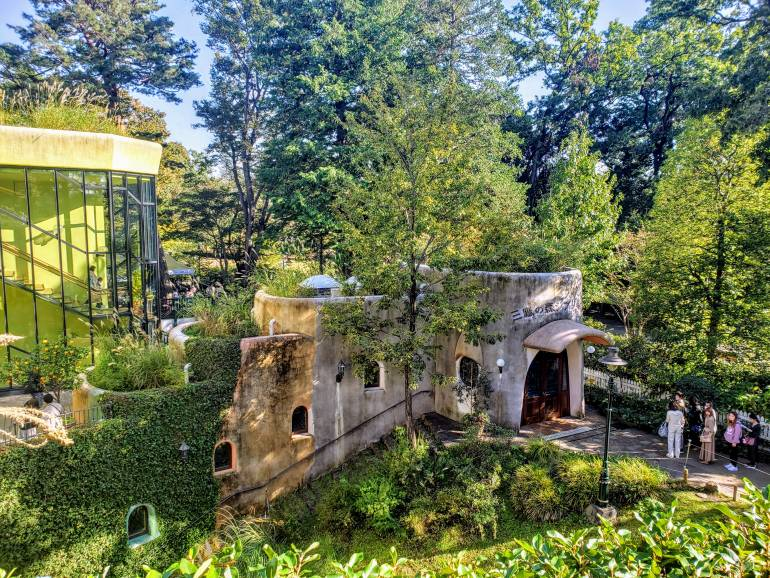
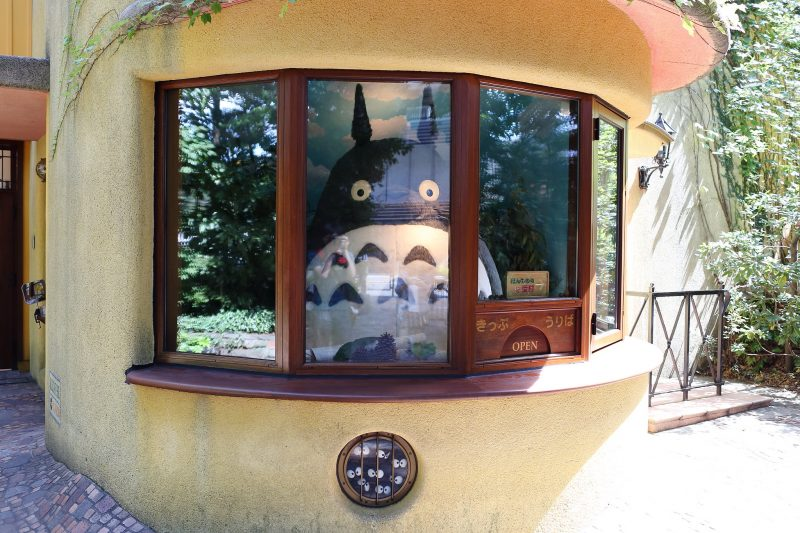
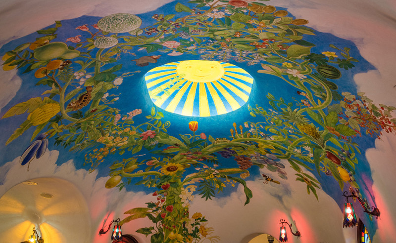
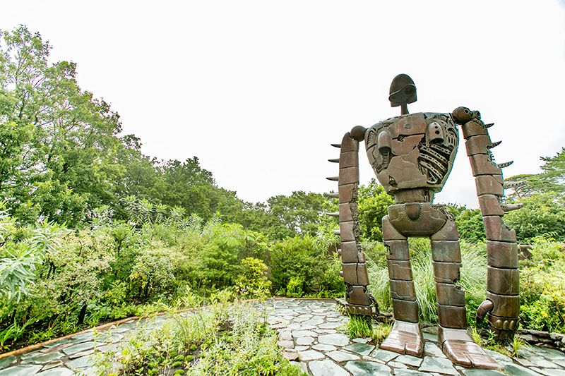

**Ghibli Museum (Mitaka, Tokyo)**

Ghibli Museum is one of Japan's most popular animation museums and a top destination for anime fans.

It focuses on the creative process behind animation and usually requires timed-entry reservations.

&emsp;&emsp;**Best season/month**

- Year-round; bookings matter more than season.

&emsp;&emsp;**Practical note**

- Reserve tickets early, especially for weekends and holiday periods.
  

