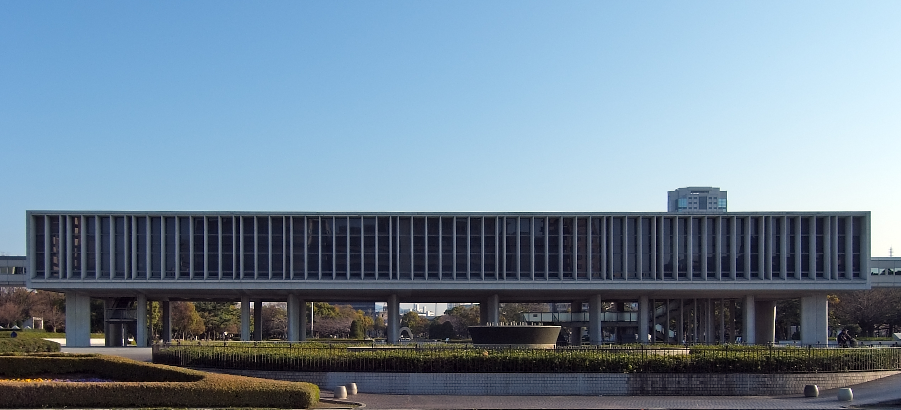

**Hiroshima Peace Memorial Museum (Hiroshima City)**

Hiroshima Peace Memorial Museum is one of Japan's most important modern-history museums.

It is typically visited together with Peace Memorial Park and the Atomic Bomb Dome.

&emsp;&emsp;**Best season/month**

- Year-round; spring and autumn are most comfortable for walking the park area.

&emsp;&emsp;**Practical note**

- Allow extra time for both museum and memorial-park sections.
