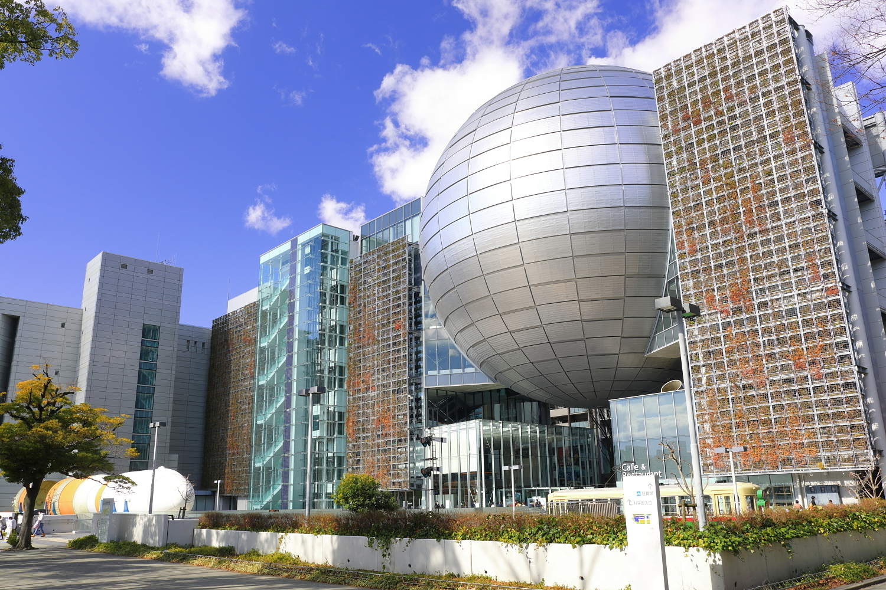
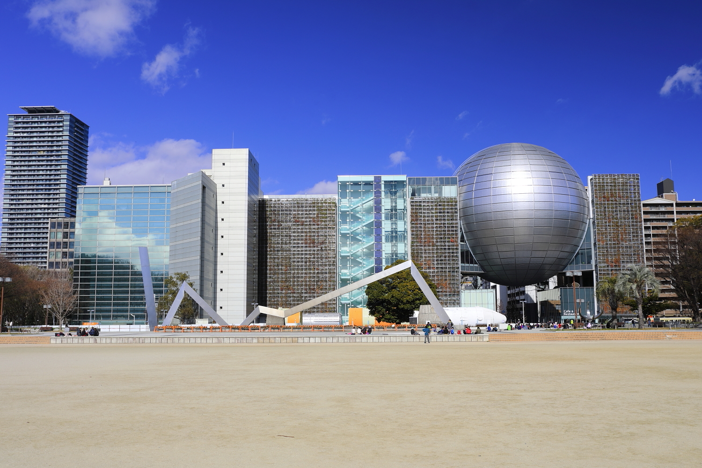
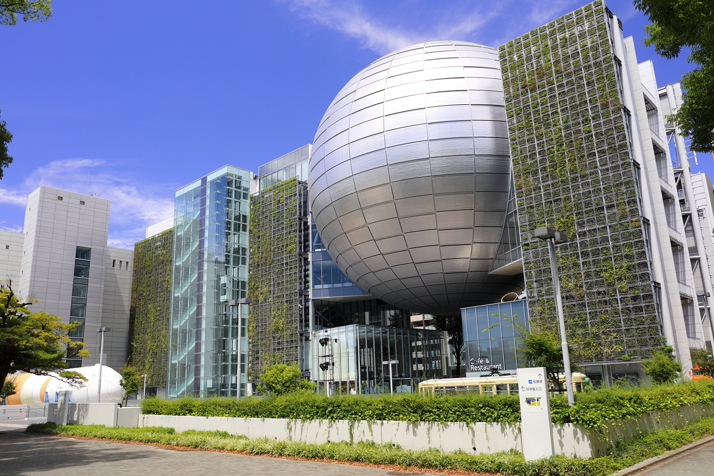
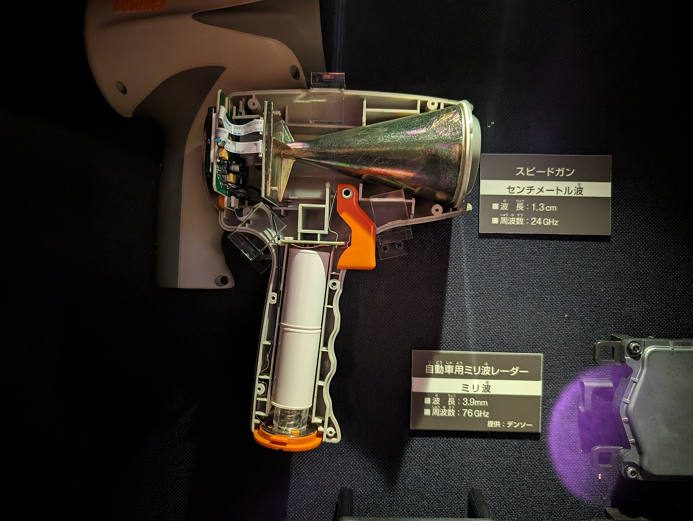

**Nagoya City Science Museum (Nagoya)**

Nagoya City Science Museum is one of Japan's best science museums and is widely known for its large planetarium dome.

It is a great space-and-astronomy stop between Tokyo and Kansai travel legs.

&emsp;&emsp;**Best season/month**

- Year-round; especially useful for indoor planning during weather disruptions.

&emsp;&emsp;**Practical note**

- Reserve planetarium tickets early when available, especially on weekends.

