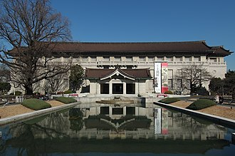

**Tokyo National Museum (Ueno, Tokyo)**

Tokyo National Museum is Japan's leading museum for Japanese art, archaeology, and cultural heritage.

It is one of the best first-stop museums for understanding historical periods before visiting temples and old districts.

&emsp;&emsp;**Best season/month**

- Year-round, especially useful on rainy or very hot days.

&emsp;&emsp;**Practical note**

- Pair with Ueno Park and nearby museum cluster for a full cultural day.
