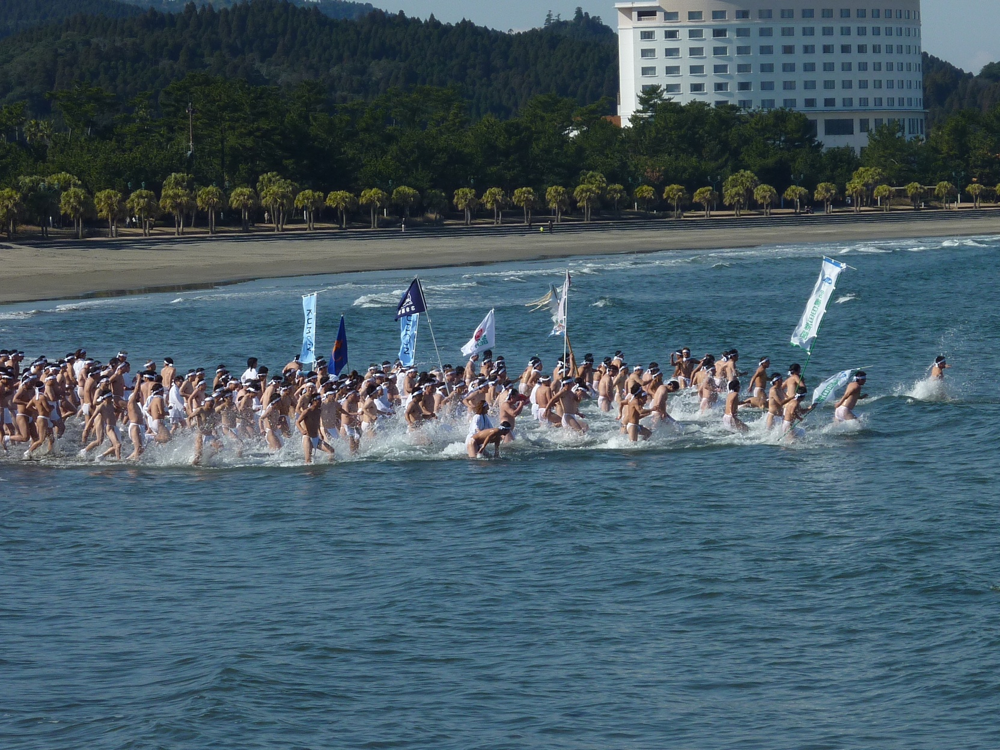

**January (1月)**

January is one of the coldest months in Japan, but it is also one of the best times to experience winter scenery, hot springs, and clear skies. 
In many parts of the country the air is dry and sunny, while Hokkaido and the Japanese Alps offer deep snow and excellent winter sports.

This is also a month of important cultural events and traditions. Here are some things to do and see in January:

* On New Year's Day (January 1), people flock to temples and shrines for hatsumode — the first shrine visit of the year. It's busy but fun. Top spots: [Meiji Jingu](../locations/temples-shrines/Meiji%20Jingu.md) in Tokyo, [Fushimi Inari Taisha](../locations/temples-shrines/Fushimi%20Inari%20Taisha.md) in Kyoto, and Sumiyoshi Taisha in Osaka.

* It's a great time to enjoy onsen, especially outdoor baths surrounded by snow in northern Japan and mountain resort towns. No swimsuits are allowed, so be prepared to experience the traditional Japanese bathing culture.

* Winter illuminations are still running in many cities in early January, so evenings can be especially atmospheric.

* In snowy regions, the landscapes are beautiful and peaceful, and winter wildlife trips, snowy villages, and mountain scenery are at their best.

