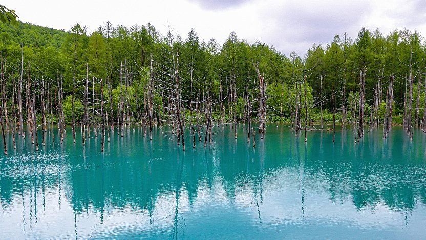
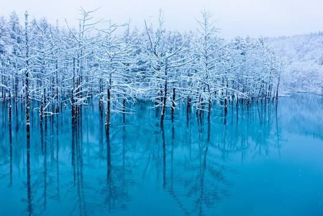

**October (10月)**

October is one of the best months to travel in Japan. The weather is usually mild, the humidity is gone, and the first major autumn colors begin spreading from the mountains and northern regions toward the rest of the country.

If you're going in October, you're in for a treat — don't miss any of this:

* It is an excellent month for hiking and comfortable city walking; for temple-focused routes see the [Temple Index](../temples-shrines/Temple%20Index.md).

* Autumn leaves start becoming a major attraction in the mountains and in Hokkaido, while lower-elevation cities gradually begin to cool down.

* Seasonal food is another highlight of October, with mushrooms, chestnuts, sweet potatoes, and other autumn dishes appearing widely.

* In Biei, the [Shirogane Blue Pond](../locations/regions/1.%20Hokkaido/Biei/Shirogane%20Blue%20Pond.md) begins its seasonal evening illumination from late October, adding another reason to visit Hokkaido in autumn.

* October is also a good month for innovation-focused travel, with events such as [CEATEC](../events/misc/CEATEC.md).

