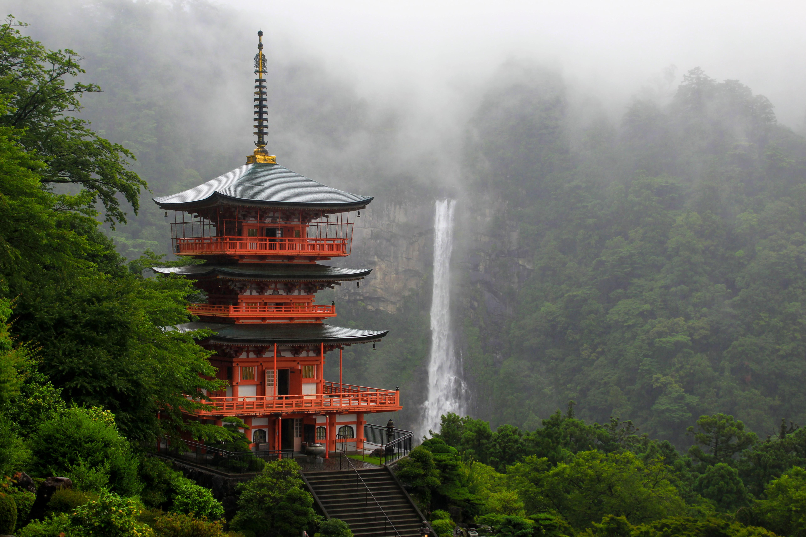

**June (6月)**

June is the rain season in Japan, with moderate to heavy rains almost every day. Because of that, it's one of the least popular months for tourism.
Hokkaido is the only place in Japan that doesn't have a rainy season, so this is a good place to go visit in June, with its famous [flower fields](../locations/regions/1.%20Hokkaido/Furano/Furano%20Flower%20Fields.md) starting to bloom.

However, there are some unique things to see in June in the rest of Japan as well:

* Because June is relatively quiet for tourism, it can be a good month to visit popular cities and temple areas (see [Temple Index](../temples/Temple%20Index.md)) with slightly fewer crowds than in spring or autumn.

* Summer is the month when traditional wind chimes are hung outside of houses, so you can hear the soothing sound of them in the evenings, as well as the sound of cicadas, which are a symbol of summer in Japan.

* Hortensias start blooming in June, and one of the best places to experience this is [Meigetsu-in](../temples/Meigetsu-in.md) in Kamakura.

* [Firefly Festival](../events/festivals/Firefly%20Festival.md) is held in many places across Japan in June.

* Rainy days can actually make temple gardens, bamboo groves, and old streets especially atmospheric; see [Temple Index](../temples/Temple%20Index.md) for ideas.

* The rice planting season starts in June, and one of the notable related events is the [Otaue Festival](../events/festivals/Otaue%20Festival.md).

* The rainy season is also a good time to visit some of the many beautiful waterfalls in Japan, such as the Nachi Falls in Wakayama, which is one of the tallest waterfalls in Japan.

* Preparations for the [Tanabata Festival](../events/festivals/Tanabata%20Festival.md), held on July 7th, start in June.

* Preparations for the [Gion Matsuri Festival](../events/festivals/Gion%20Matsuri%20Festival.md), held in Kyoto in July, also start in June.

* Seasonal foods such as cold noodles, matcha sweets, and early summer fruits start appearing more often in cafés and restaurants, which makes June enjoyable even on wet days.
