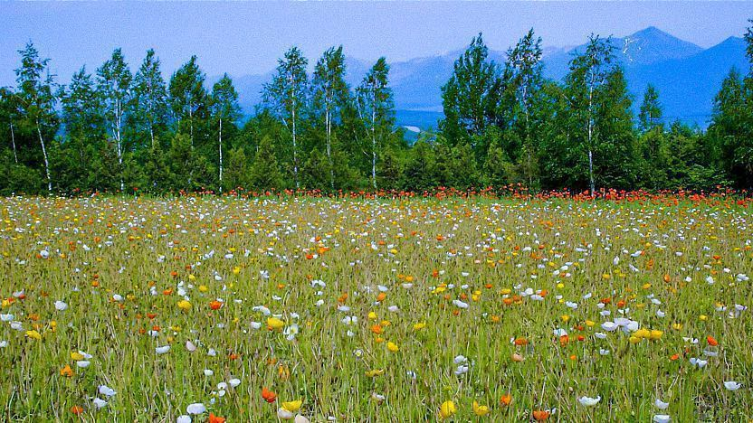
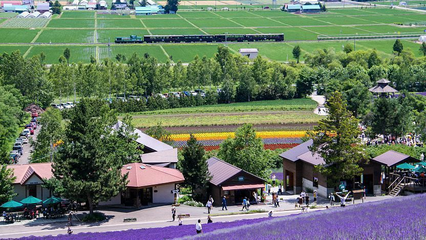

**July (7月)**

The rainy season usually ends in early July, and the weather becomes hot and humid. It's a good time to visit the beach or go hiking in the mountains to escape the heat. However, July is also the month when many festivals are held across Japan, so it's a great time to experience Japanese culture and traditions. Some of the most famous festivals in July include:

* [Tanabata Festival](../events/festivals/Tanabata%20Festival.md) is held on July 7th.

* [Gion Matsuri Festival](../events/festivals/Gion%20Matsuri%20Festival.md) is one of Japan's most famous traditional festivals and is held in Kyoto throughout July.

* [Sumida River Fireworks Festival](../events/festivals/Sumida%20River%20Fireworks%20Festival.md) in Tokyo is one of the largest fireworks festivals in Japan.

* [Obon Festival](../events/festivals/Obon%20Festival.md) is held in mid-July in some regions and mid-August in others.

* In Hokkaido, July is also one of the best times to see the [Furano flower fields](../locations/regions/1.%20Hokkaido/Furano/Furano%20Flower%20Fields.md), which are at their most colorful in mid summer.

* For otaku-focused trips, July can align with [Wonder Festival](../events/otaku/Wonder%20Festival.md) and the broader summer [Comiket](../events/otaku/Comiket.md) planning period.

