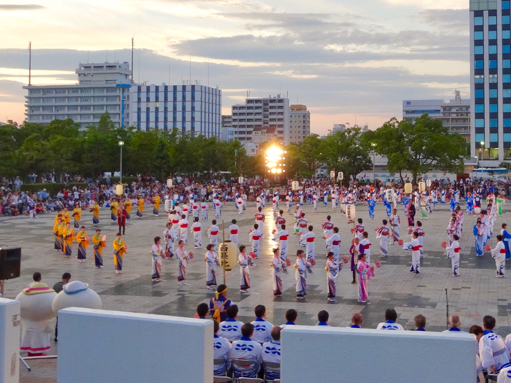

**August (8月)**

August is one of the hottest months in Japan, with high temperatures and strong humidity in many cities. It is also one of the liveliest months of the year, with summer festivals, fireworks, and long evenings full of activity.

August is a lot — in the best way possible. Here's what to look out for:

* Summer fireworks festivals are held across the country, including the [Sumida River Fireworks Festival](../events/festivals/Sumida%20River%20Fireworks%20Festival.md).

* In many regions, [Obon Festival](../events/festivals/Obon%20Festival.md) takes place in mid August.

* Hokkaido is especially attractive in August because it is cooler than the rest of Japan, and places such as the [Furano flower fields](../locations/regions/1.%20Hokkaido/Furano/Furano%20Flower%20Fields.md) are still very colorful.

* August can include the summer edition of [Comiket](../events/otaku/Comiket.md), a major fan-creation event in Tokyo.

