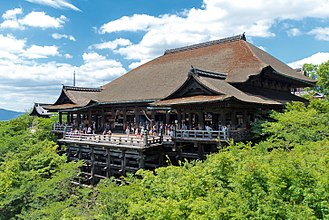

**Kiyomizu-dera (Kyoto)**

Kiyomizu-dera is one of Kyoto's most iconic temples, known for its wooden stage and hillside views over the city.

It is usually paired with Higashiyama lanes, historic streets, and nearby shrine/temple walks.

&emsp;&emsp;**Best season/month**

- March-April for spring blossoms.
- November for autumn foliage.

&emsp;&emsp;**Practical note**

- Start before 08:00 to avoid peak crowd times.
