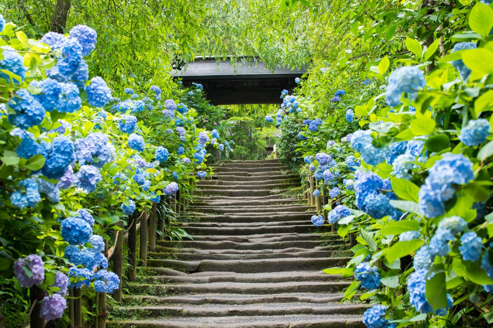
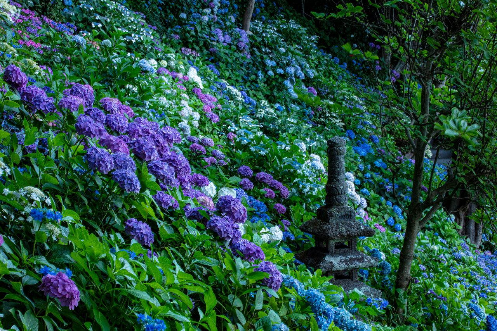

**Meigetsu-in (Kamakura)**

Meigetsu-in is one of Japan's most famous hydrangea temples, often called the "Hydrangea Temple" in June.

It is a top seasonal stop for early-summer flower travel and slower temple-garden walks.

&emsp;&emsp;**Best season/month**

- June (peak hydrangea period).

&emsp;&emsp;**Practical note**

- Visit on weekday mornings in June to reduce queue times.
