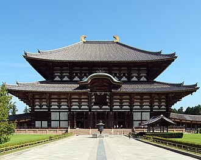

**Todai-ji (Nara)**

Todai-ji is one of Japan's most important historic temples and a core site in Nara's old-capital heritage area.

The temple is commonly combined with Nara Park and surrounding traditional districts for a full-day cultural route.

&emsp;&emsp;**Best season/month**

- Spring and autumn for comfortable park and temple walking.

&emsp;&emsp;**Practical note**

- Pair with early-morning entry to avoid school-group peak periods.
